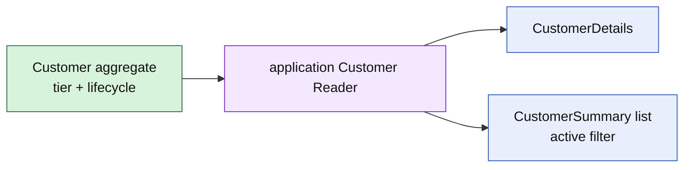

# Lesson 024: Customer Query Surface

## Objective

Expose Customer details and summaries through an application read surface without turning the Customer aggregate into a browsing model.

## Theory

Customer owns tier, payment terms, active state, and lifecycle commands. Customer-facing screens need a compact projection and an active/inactive filter, not direct access to aggregate internals.

The application reader translates Customer state into details and summaries. It remains separate from the domain commands and can later use a different read store.

## Why This Matters Here

The complete query surface makes the read/write distinction concrete across the model. Rich aggregates remain small and expressive, while applications can compose read views for screens and reports.

## Diagram

## Implementation Focus

Implement only:

- Customer detail and summary view types
- an application `Reader` contract
- an in-memory projection with optional active filtering
- tests for classification and lifecycle projection
- demo query output

Leave customer search, pagination, and persistence adapters for later work.

## What To Verify

- `go test ./...` passes
- Customer details include tier, payment terms, and active state
- active filtering works
- missing customers return a query-specific error
- the query surface does not change Customer state
