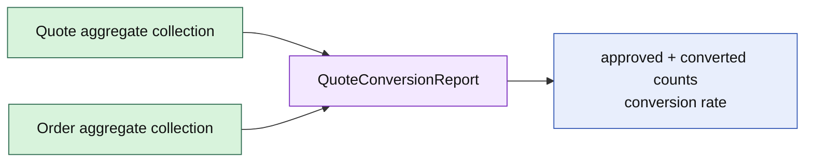

# Lesson 025: Quote Conversion Report

## Objective

Build an application report that compares approved Quotes with Orders created from them without adding reporting logic to either aggregate.

## Theory

Quote conversion is a relationship across aggregate collections. A report can count total and approved quotes, match Orders to their source Quote IDs, and calculate a conversion rate.

This is application read logic, not a domain command. It does not mutate Quote or Order and it does not decide whether a conversion is legal; Order creation already owns that invariant.

## Why This Matters Here

Rich aggregates should not know how many siblings exist or how to aggregate across domains. Reports are a separate consumer of domain state and can be replaced by a query adapter later.

## Diagram

## Implementation Focus

Implement only:

- Quote conversion report types
- matching by source Quote identity
- conversion-rate calculation
- deterministic tests and demo output

Leave persistence queries and dashboard transport for later work.

## What To Verify

- `go test ./...` passes
- approved and total quote counts are correct
- Orders are matched by source Quote ID
- zero quotes do not divide by zero
- report generation does not mutate aggregates
