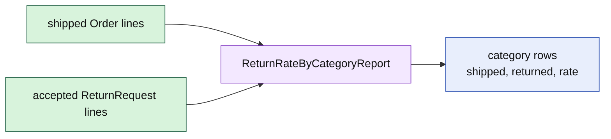

# Lesson 026: Return Rate By Category Report

## Objective

Calculate return rates by product category from shipped Orders and accepted ReturnRequests.

## Theory

Return rate is a cross-aggregate read calculation. Orders provide shipped quantities by category; accepted ReturnRequests provide returned quantities. Neither aggregate should know how to aggregate across many records.

The report groups by category, calculates a ratio only when shipped quantity is positive, and returns deterministic row ordering.

## Why This Matters Here

Rich aggregates protect local business invariants; reports answer questions across aggregate boundaries. Keeping this calculation in the application/reporting surface avoids adding analytics state or collection knowledge to Order and ReturnRequest.

## Diagram

## Implementation Focus

Implement only:

- category report row and report types
- shipped/accepted quantity aggregation
- deterministic sorting and safe rate calculation
- tests and demo output

Leave historical persistence and dashboard delivery for later work.

## What To Verify

- `go test ./...` passes
- shipped quantities are counted by category
- only accepted returns contribute to returned quantities
- rates are correct and sorted
- report generation does not mutate domain objects
