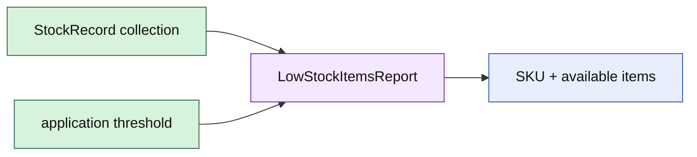

# Lesson 027: Low-Stock Items Report

## Objective

Build an application report that identifies StockRecord aggregates at or below a chosen availability threshold.

## Theory

Low-stock reporting is a collection-level question. Each StockRecord owns its availability and low-stock rule, while the report selects and sorts many records for an operational view.

The report consumes the aggregate's public query methods and does not recalculate or mutate stock state.

## Why This Matters Here

The report demonstrates the boundary between aggregate behavior and application composition. StockRecord remains authoritative for available quantity; the report chooses the threshold and presentation shape.

## Diagram

## Implementation Focus

Implement only:

- low-stock report row and report types
- threshold-based selection using StockRecord.Available
- deterministic item ordering
- tests and demo output

Leave replenishment commands and notification delivery for later work.

## What To Verify

- `go test ./...` passes
- records at or below the threshold are included
- records above the threshold are excluded
- report ordering is deterministic
- report generation does not mutate stock aggregates
