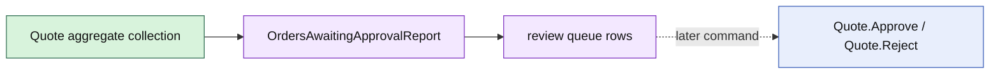

# Lesson 028: Orders Awaiting Approval Report

## Objective

Build an application report for Quotes waiting for human approval.

## Theory

The approval queue is a read-side concern. The Quote aggregate decides whether a transition to `PendingApproval` is legal; the report selects those aggregates and projects the information a reviewer needs: Quote ID, Customer ID, line count, and total.

The report does not approve, reject, or mutate a Quote. A later workflow can consume a queue row and issue an aggregate command.

## Why This Matters Here

Keeping the queue outside Quote avoids mixing operational collection concerns with the aggregate's local lifecycle. It also makes the human-review boundary explicit without adding a repository or UI dependency to the domain model.

## Diagram

## Implementation Focus

Implement only:

- approval queue row and report types
- selection of PendingApproval Quotes
- total projection and deterministic rows
- tests and demo output with one pending CustomBuild quote

Leave reviewer assignment and approval workflow coordination for later lessons.

## What To Verify

- `go test ./...` passes
- only PendingApproval quotes appear
- queue rows contain the expected totals and line counts
- report generation does not mutate Quote status
