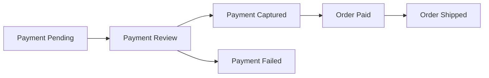

# Lesson 029: Payment Review Workflow

## Objective

Model manual payment review as an explicit domain outcome before an order becomes paid.

## Theory

A payment can be captured immediately, sent for review, or failed. Review is a business state, not a technical exception. Payments owns its state, and Ordering translates that outcome into its own `PaymentReview` state.

The application coordinates the two aggregates, but neither aggregate reaches into the other. A payment review decision is applied to the payment and then reflected in the order through the order's own transition.

## Why This Matters Here

Explicit review states prevent shipment from starting while a payment still needs an operator decision. They also make rejected reviews observable instead of hiding them behind a generic failed or pending status.

## Diagram

## Implementation Focus

- add review, approve, and reject transitions to `Payment`
- add `PaymentReview` and approval transitions to `Order`
- preserve the existing paid-to-shipped boundary
- keep coordination outside both aggregates

## What To Verify

- `go test ./...` passes
- a payment can enter review and later be approved
- an order in `PaymentReview` cannot be shipped
- a rejected review cannot be captured or shipped
