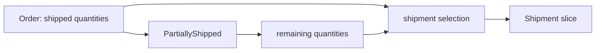

# Lesson 030: Partial Shipment Support

## Objective

Allow an order to ship in multiple quantity-aware steps.

## Theory

An order may be paid before every item is available. Ordering therefore tracks shipped quantity per line and exposes a `PartiallyShipped` state. Fulfillment records the selected slice in each `Shipment` aggregate.

The order owns the invariant that a quantity cannot ship twice. A shipment owns the lifecycle and the snapshot of one dispatch. The application coordinates dispatch and then applies the shipment selection to the order.

## Why This Matters Here

Progress belongs to the Order lifecycle, while the Shipment aggregate records what a particular dispatch carried. The domain remains explicit about both the total ordered quantity and the quantity already shipped.

## Diagram

## Implementation Focus

- add shipped quantity and `PartiallyShipped` to `Order`
- validate and apply explicit shipment selections
- create shipments from selected remaining quantities
- keep cancellation blocked after shipping starts

## What To Verify

- `go test ./...` passes
- a partial shipment records only the requested quantity
- a later shipment completes the order
- partially shipped orders cannot be cancelled
