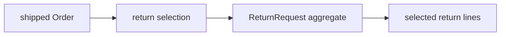

# Lesson 031: Partial Returns by Line

## Objective

Allow a return request to select only part of the quantities shipped on an order.

## Theory

A return is a claim against shipped quantities, not automatically against the entire order. `ReturnRequest` validates a selection against the order's shipped quantity and stores only the selected lines.

The selection is copied into the return aggregate as a snapshot. Later changes to the order cannot silently change what the customer requested to return.

## Why This Matters Here

The aggregate boundary keeps quantity rules close to the return decision while the application remains responsible for collecting the user's selection.

## Diagram

## Implementation Focus

- add a selection-aware return constructor
- validate positive quantities and shipped limits
- preserve the existing full-return convenience constructor
- keep the return line as a price snapshot

## What To Verify

- `go test ./...` passes
- a partial line is accepted
- a selection larger than shipped quantity is rejected
- the full-return constructor still returns all shipped quantities
