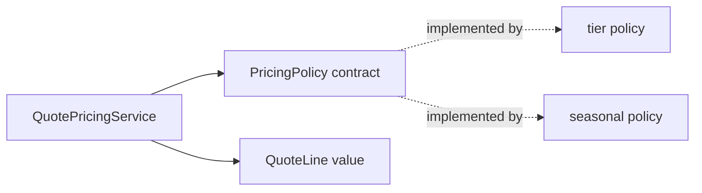

# Lesson 032: Plugin Pricing Extension Point

## Objective

Let an optional pricing policy change quote-line prices without changing the `Quote` aggregate or its lifecycle.

## Theory

Quoting owns the pricing-policy contract because pricing creates Quoting values. The application can provide another policy, such as a seasonal discount, while `QuotePricingService` continues to orchestrate the same workflow.

The plugin supplies a domain behavior through a narrow contract. It does not become a second quote aggregate and it cannot bypass quote-line validation or quote lifecycle rules.

## Why This Matters Here

The extension point is a contract at the domain boundary: outsiders can supply behavior, but they cannot bypass `Quote` invariants.

## Diagram

## Implementation Focus

- preserve the `PricingPolicy` contract
- preserve the default tier policy
- add a seasonal policy that composes the default policy
- keep quote lifecycle behavior unchanged

## What To Verify

- `go test ./...` passes
- the default policy keeps existing prices
- the seasonal policy changes only the effective price
- the quote aggregate still owns line and lifecycle invariants
