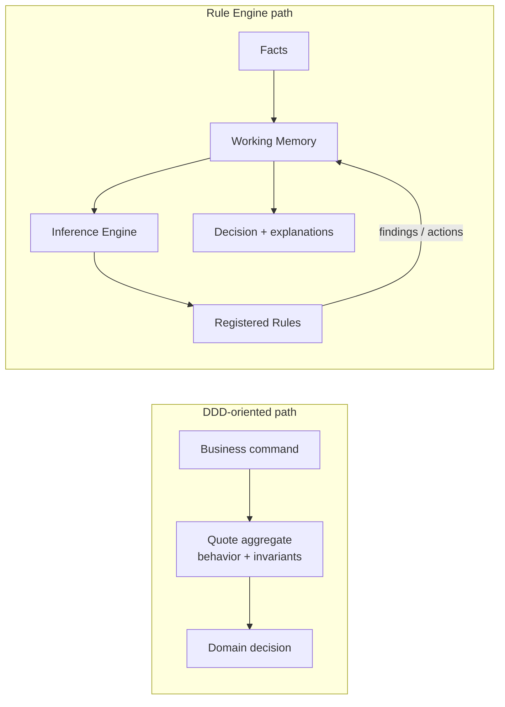

# Lesson 000: From Rich Domain Model To Rule Engine

## Objective

Explain how the same product requirements move from a DDD-oriented design to a Rule Engine / Knowledge-Based Architecture.

This is a transition lesson and intentionally adds no application code.

## Theory

In a Rich Domain Model or DDD-oriented implementation, business behavior is attached to domain concepts and consistency boundaries:

- a `Quote` aggregate owns quote lifecycle rules
- entities and value objects protect invariants
- domain services coordinate decisions that do not belong to one aggregate

A Rule Engine changes the center of gravity. The business objects become mostly passive Facts, and independent Rules evaluate those Facts:

- Facts describe the current situation
- a Working Memory holds the Facts and emerging findings
- Rules express `when` conditions and `then` actions
- the Engine controls evaluation order and conflict resolution

The business behavior should remain equivalent. What changes is where that behavior is represented and who controls its execution.

## Why This PRD Fits A Rule Engine

The PRD already contains several rules that are likely to change or overlap:

- `CustomBuild` products require approval
- discounts above `15%` require approval
- discounts above `25%` are rejected
- `Preferred` customers receive automatic discount eligibility
- payment review depends on a configurable monetary threshold
- return and shipping policies interact with order state and customer terms

This makes the Rule Engine tradeoff meaningful. Adding or changing a policy should usually mean adding or changing a Rule, not expanding one large `OrderService` or adding another branch to an aggregate method.

The cost is that behavior becomes less local. A developer may need to inspect several Rules and their precedence to understand one final decision. Deterministic conflict resolution and good explanations therefore become first-class requirements.

## The Main Comparison

| Question | DDD-oriented design | Rule Engine design |
| --- | --- | --- |
| What is the main unit of behavior? | Aggregate, entity, or domain service | Independent Rule |
| What enters the decision? | Commands sent to domain objects | Facts placed in Working Memory |
| Where does orchestration live? | Application/domain coordination | Inference Engine / Controller |
| How is a new policy added? | Extend an owner or domain service | Add and register a Rule |
| Main risk | Overloaded aggregates or services | Hidden rule interactions and precedence bugs |

This is a comparison of architectural emphasis, not a claim that one style is universally better.

## Diagram

The Rule Engine path makes the data/behavior split explicit. Facts do not decide anything by themselves; the Engine activates Rules against the shared Working Memory.

## Implementation Focus

This transition lesson establishes the vocabulary and comparison boundary only.

The next lesson will implement:

- passive `CustomerFact`, `ProductFact`, and `QuoteFact` structures
- a `WorkingMemory` container
- a small CLI that loads the same PRD language into memory

It will deliberately stop before the `Rule` interface, rule registration, evaluation, and conflict resolution.

## What To Verify

- the same PRD rules can be represented either as domain behavior or as independent Rules
- Facts are data, not miniature aggregates with hidden business methods
- the Engine becomes the place where rule evaluation is coordinated
- the next lesson can start with a data-only Working Memory without introducing a generic service layer
