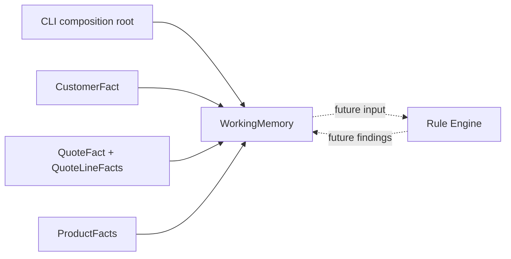

# Lesson 001: Facts And Working Memory

## Objective

Build the first runnable Rule Engine slice: represent the current business situation as passive Facts and place them in a shared Working Memory.

No Rule evaluates the Facts yet.

## Theory

Rules need a stable input model. In this architecture, the input model is not a behavior-rich `Quote` aggregate. It is a collection of Facts that describe what is currently true:

- the customer's tier and payment terms
- the quote's lines, status, and discount
- the products involved, including category and available stock

`WorkingMemory` is the boundary between the application and the future inference engine. It carries the Facts in and will later carry findings, decisions, and rule-produced actions out.

The Facts intentionally have no methods such as `Quote.SubmitForApproval` or `Quote.ApplyDiscount`. That is the first visible difference from the DDD-oriented tracks. The business rules will be introduced as separate Rule objects in later lessons.

## Why This Matters Here

The seeded quote contains two useful signals from the PRD:

- it contains a `CustomBuild` product
- it has a `20%` discount

Those signals will eventually activate different Rules. For now, the Working Memory only records them. Keeping the state passive lets several independent Rules inspect the same situation without giving one domain object ownership of the entire decision.

## Diagram



The dashed arrows are deliberately future boundaries. This lesson only creates and displays the Working Memory.

## Implementation Focus

Implement:

- a standalone Go module for the Rule Engine track
- passive `CustomerFact`, `ProductFact`, `QuoteFact`, and `QuoteLineFact` types
- a `Finding` data type for future rule output
- `WorkingMemory` and a constructor that copies the initial Facts
- a CLI demo that loads and prints the seeded scenario

Deliberately leave these for later lessons:

- the `Rule` interface
- `When`/`Then` evaluation
- rule registration and the inference Engine
- priority and conflict resolution

## What To Verify

From the `rules-engine-architecture` folder, run:

```text
go test ./...
go run ./cmd/quote-demo
```

The output should show the customer, quote, product Facts, and zero findings. No approval or discount decision should be produced yet because no Rule has been registered.
