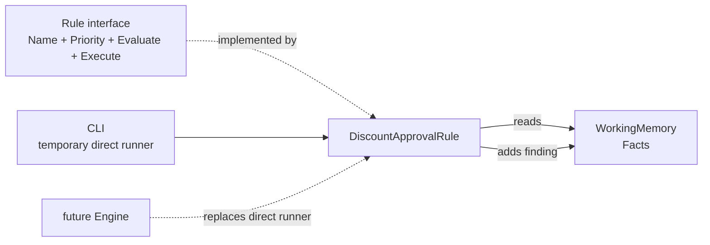

# Lesson 002: Rule Contract And The First Policy

## Objective

Introduce the contract that separates a business policy from the Facts it evaluates, then implement the first independent Rule from the PRD.

## Theory

A Rule has two distinct parts:

- `Evaluate`: the condition that decides whether the policy applies
- `Execute`: the action that records the policy outcome

The `Rule` interface also exposes a name and priority. Priority is not used by the demo yet, but it gives the future Engine the metadata it needs for deterministic conflict resolution.

The Rule receives `WorkingMemory`, not a `Quote` aggregate. It reads the passive Facts and writes a finding back to the same shared context.

## Why This Matters Here

The seeded quote has a `20%` discount. The PRD says discounts above `15%` require manager approval, so this is the first policy that should activate.

The policy is now isolated from the CLI and from the Fact definitions:

- changing the threshold belongs to this Rule
- adding a new policy means adding another Rule
- the quote data remains passive
- the future Engine will decide which registered Rules to evaluate

For this lesson the CLI invokes one Rule directly. That temporary wiring keeps the condition/action split visible before the Engine takes over orchestration.

## Diagram



The Rule owns the policy, while the Working Memory owns the current Facts and findings. The Engine boundary is deliberately deferred.

## Implementation Focus

Implement:

- the `Rule` interface in the engine package
- `WorkingMemory.AddFinding`
- `DiscountApprovalRule` with the `>15%` condition
- direct evaluation and execution from the CLI
- a focused test for the rule condition and finding

Deliberately leave these for later lessons:

- the Rule Engine and registration API
- the `>25%` rejection rule
- conflict resolution and priority ordering
- rule chaining or repeated inference cycles

## What To Verify

From the `rules-engine-architecture` folder, run:

```text
go test ./...
go run ./cmd/quote-demo
```

The demo should produce one finding explaining that the `20%` discount requires manager approval. The output should still be deterministic and should not contain a rejection finding yet.
