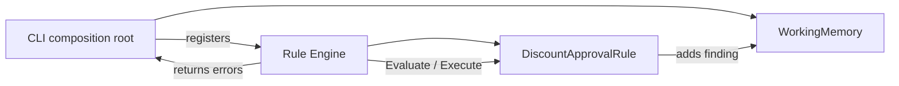

# Lesson 003: Rule Engine Registration

## Objective

Replace direct Rule invocation with a small inference Engine that owns Rule registration and evaluation.

## Theory

The Engine is the point where Rule-Based Architecture applies inversion of control to business logic. The CLI no longer decides which Rule to evaluate or how to run its condition and action. It supplies the Working Memory and delegates evaluation to the Engine.

The first Engine is intentionally small:

- `Register` adds a Rule to the working set
- `ExecuteAll` evaluates registered Rules in registration order
- only active Rules execute their actions
- execution errors stop the cycle and are returned to the caller

The Rule priority is already part of the contract, but this lesson does not use it yet. That omission is deliberate: registration and execution are one concept, while conflict resolution is a separate architectural concern for the next lessons.

## Why This Matters Here

Direct invocation works for one Rule, but it makes the application responsible for the inference workflow. Every new policy would require more orchestration code in the CLI or use case.

With the Engine boundary:

- the application composes Facts and registers Rules
- the Engine controls evaluation
- Rules remain independent policy units
- future conflict resolution can change inside the Engine without changing each Rule

This is the first point where the architecture starts to look like a Rule Engine rather than a collection of policy functions.

## Diagram



The Engine owns the execution loop. The Rule still owns its condition and action, and the Working Memory remains the shared state passed through the evaluation.

## Implementation Focus

Implement:

- `Engine` with `NewEngine`, `Register`, and `ExecuteAll`
- registration of the existing `DiscountApprovalRule`
- error propagation from Rule execution
- an Engine-level test proving a registered Rule is evaluated
- CLI output driven by the Engine rather than direct Rule calls

Deliberately leave these for later lessons:

- priority sorting
- conflicting approval and rejection Rules
- repeated inference cycles or rule chaining
- dynamic enable/disable configuration

## What To Verify

From the `rules-engine-architecture` folder, run:

```text
go test ./...
go vet ./...
go run ./cmd/quote-demo
```

The demo should still produce one approval finding for the `20%` discount, but the CLI should no longer call `Evaluate` or `Execute` directly.
