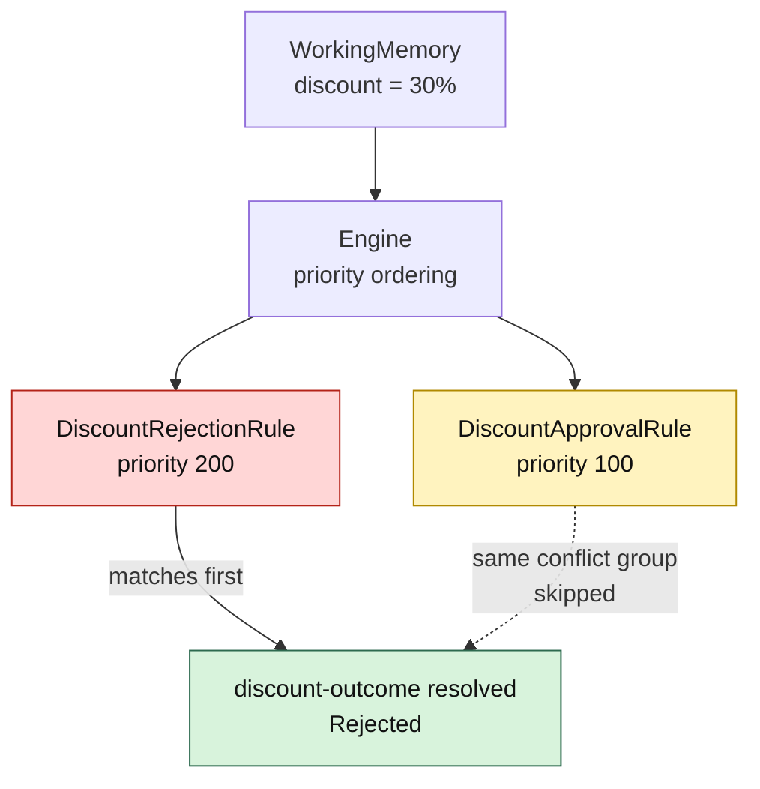

# Lesson 004: Conflict Resolution And Priority

## Objective

Make overlapping Rules deterministic by introducing conflict groups and priority-aware evaluation.

## Theory

Rule independence does not mean that every matching Rule should execute together. The PRD contains an intentional overlap:

- discounts above `15%` require approval
- discounts above `25%` are rejected

At `30%`, both conditions are true. If the Engine simply executes every matching Rule, the Working Memory would contain contradictory outcomes: approval required and rejected.

This lesson adds two pieces of metadata:

- `Priority`: higher-priority policies are considered first
- `ConflictGroup`: only one matching Rule may resolve a given decision group

The Engine sorts Rules by descending priority. Once a Rule matches and executes in a non-empty conflict group, lower-priority Rules in that same group are skipped. Rules in different groups can still all contribute findings.

This is a deliberately small conflict policy. A larger system might use decision tables, explicit outcome types, or a richer agenda, but the architectural boundary is now visible.

## Why This Matters Here

Priority is not merely a number stored on a Rule. It is a business decision about which policy wins when conditions overlap.

For the discount policies:

- `DiscountRejectionRule` has priority `200`
- `DiscountApprovalRule` has priority `100`
- both belong to `discount-outcome`

Therefore a `30%` discount produces one deterministic rejection finding. A `20%` discount does not activate the rejection Rule and still produces the approval finding.

## Diagram



The conflict group limits suppression to competing discount outcomes. It does not prevent unrelated policy groups from running.

## Implementation Focus

Implement:

- `ConflictGroup` in the `Rule` contract
- `DiscountRejectionRule` for discounts above `25%`
- priority ordering in the Engine
- one-match-per-conflict-group resolution
- tests proving that a `30%` discount yields one rejection finding

Deliberately leave these for later lessons:

- dynamic rule configuration
- enabling and disabling policies at runtime
- repeated inference cycles and rule chaining
- decision tables or external rule definitions

## What To Verify

From the `rules-engine-architecture` folder, run:

```text
go test ./...
go vet ./...
go run ./cmd/quote-demo
```

The existing `20%` demo should still produce an approval finding. The Engine-level test should prove that a `30%` discount produces exactly one rejection finding, regardless of registration order.
