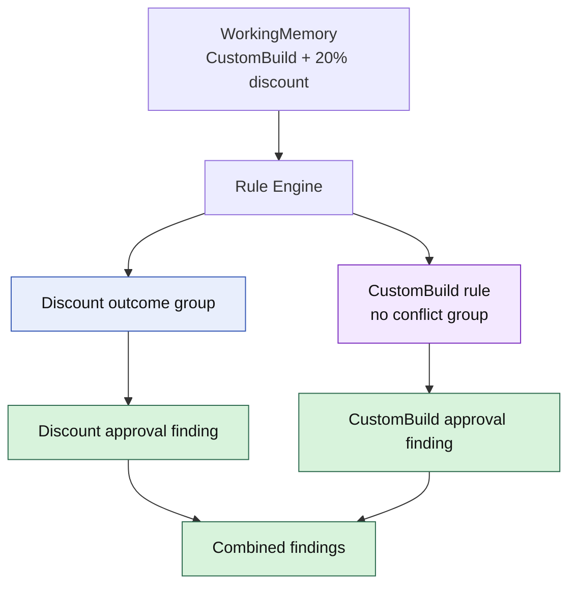

# Lesson 005: Independent Policy Groups

## Objective

Show that conflict resolution applies only to competing outcomes, while independent policy Rules can contribute findings together.

## Theory

A Rule Engine should not become a global “first matching Rule wins” chain. Real business decisions often require several findings at once.

The current quote demonstrates this:

- its `20%` discount requires approval
- its `CustomBuild` product also requires approval

Those are two different reasons for the same broader workflow. They should both be visible to the caller.

The Engine therefore treats an empty `ConflictGroup` as non-competing. Such a Rule always executes when its condition matches. A non-empty group is reserved for mutually exclusive outcomes such as approval versus rejection for the same discount decision.

This distinction keeps the architecture expressive:

- conflict groups prevent contradictory outcomes
- independent Rules accumulate complementary findings

## Why This Matters Here

The PRD explicitly contains several policies that can overlap without contradicting one another:

- product category may require approval
- discount level may require approval
- payment amount may require review
- customer terms may permit invoicing for shipment

If the Engine stopped after the first approval-related Rule, it would hide important reasons from the user and manager. The Rule Engine must resolve true conflicts without suppressing independent business knowledge.

## Diagram



The Engine resolves competition inside the discount group while allowing the independent CustomBuild Rule to run.

## Implementation Focus

Implement:

- `CustomBuildApprovalRule`
- an empty conflict group for non-competing policy findings
- registration of the new Rule
- tests proving independent findings are accumulated together

Deliberately leave these for later lessons:

- a final approval decision object built from findings
- configurable rule enablement
- persistence or external rule definitions
- rule chaining based on newly produced Facts

## What To Verify

From the `rules-engine-architecture` folder, run:

```text
go test ./...
go vet ./...
go run ./cmd/quote-demo
```

The current scenario should now produce two findings: one for the `20%` discount and one for the `CustomBuild` product. Neither finding should suppress the other.
