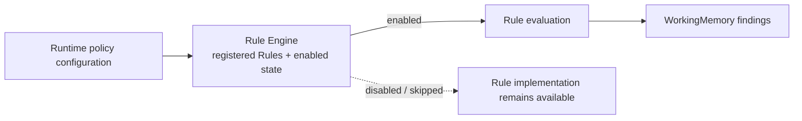

# Lesson 006: Configurable Rule Activation

## Objective

Allow the active policy set to be configured at runtime without changing or recompiling individual Rule implementations.

## Theory

The PRD calls for evolving policies and explicitly includes configurable rule behavior. Registration alone is not enough: an administrator or deployment configuration may need to disable a policy temporarily while keeping its implementation available.

The Engine now keeps a small registration record for each Rule:

- the Rule implementation
- whether that Rule is enabled

Rules are enabled by default when registered. `SetRuleEnabled` changes the active policy set by Rule name. Disabled Rules are skipped before evaluation, so they cannot add findings or resolve a conflict group.

This is still a lightweight in-memory configuration boundary. A later implementation could load the enabled names from a file, environment, or administration store without changing the Rule contract.

## Why This Matters Here

Policy volatility is one of the reasons to choose a Rule Engine. If a CustomBuild approval policy is temporarily not applicable for a deployment or customer segment, the caller should not need to edit `CustomBuildApprovalRule` or remove its code from the module.

The tradeoff is configuration integrity. Rule names become configuration keys, so the Engine should report unknown names and deployment tooling should validate the active policy set.

## Diagram



Configuration changes the active policy set at the Engine boundary. The Rule implementation and its contract remain unchanged.

## Implementation Focus

Implement:

- enabled state for registered Rules
- `Engine.SetRuleEnabled`
- skipping disabled Rules before evaluation and conflict resolution
- a CLI flag that disables `CustomBuildApprovalRule`
- tests proving a disabled Rule contributes no finding

Deliberately leave these for later lessons:

- persistent configuration storage
- hot reload and configuration versioning
- authorization for policy changes
- external rule definitions or a decision-table format

## What To Verify

From the `rules-engine-architecture` folder, run:

```text
go test ./...
go vet ./...
go run ./cmd/quote-demo
go run ./cmd/quote-demo --disable-custom-build
```

The default run should produce two findings. The flagged run should produce only the discount approval finding, while the CustomBuild Rule implementation remains in the codebase.
