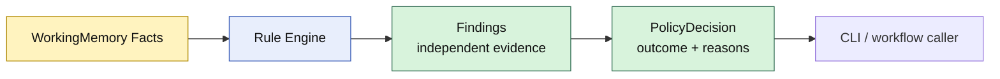

# Lesson 007: Decision And Explainability

## Objective

Turn the accumulated Rule findings into one stable, explainable policy decision for the application boundary.

## Theory

Rules should report the evidence they know how to produce. The caller should not need to understand every Rule name, severity string, conflict group, or priority to decide what the user sees next.

The Engine therefore adds a decision boundary after Rule execution:

- `allowed`: no blocking or approval finding exists
- `needs-approval`: at least one independent policy requires approval
- `rejected`: at least one policy explicitly rejects the situation

The decision contains the contributing Findings as reasons. Rejection has precedence over approval because a rejected policy cannot be satisfied merely by obtaining approval.

This is different from conflict resolution:

- conflict resolution decides which competing Rule in one group may execute
- decision summarization combines the outcomes of independent groups

## Why This Matters Here

The current quote activates two independent approval policies. The application should receive one answer—`needs-approval`—while still being able to explain both reasons to a manager.

If a `30%` discount activates the rejection Rule and a CustomBuild line activates its approval Rule, the decision should be `rejected` with both findings retained as explanation. The caller does not need to reproduce that precedence logic.

This keeps the Rule Engine boundary useful to CLI, HTTP, or future workflow code: they consume a stable decision instead of interpreting raw internal rule mechanics.

## Diagram



The Engine is responsible for interpreting policy evidence into the application-facing decision. The Rules remain focused on their individual conditions and actions.

## Implementation Focus

Implement:

- `PolicyDecision` and stable decision outcomes
- `Engine.Decide`
- deterministic precedence of rejection over approval
- preservation of Findings as explainable reasons
- CLI output using the decision boundary
- tests for approval and rejection decisions

Deliberately leave these for later lessons:

- changing quote or order state from a decision
- manager approval commands and workflow persistence
- notifications or domain events
- external decision consumers such as HTTP handlers

## What To Verify

From the `rules-engine-architecture` folder, run:

```text
go test ./...
go vet ./...
go run ./cmd/quote-demo
```

The current scenario should report `needs-approval` with two reasons. A high-discount test should report `rejected` while retaining any independent approval findings as explanation.
