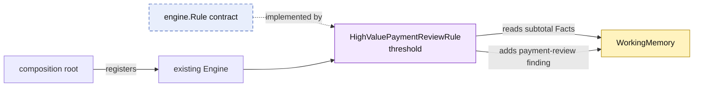

# Lesson 008: A New Configured Policy Rule

## Objective

Add a new business policy through the existing Rule extension point without changing the Engine or the previously implemented Rules.

## Theory

The most important extensibility promise of this architecture is now testable:

1. create a new Rule type
2. give it the Facts and configuration it needs
3. register it with the Engine
4. leave the Engine's evaluation and conflict machinery unchanged

This lesson adds a payment-review policy with an injected monetary threshold. The Rule calculates the quote subtotal from passive Facts and contributes a finding when the threshold is exceeded.

The threshold belongs to the Rule instance rather than being hardcoded into the Engine. That keeps policy configuration close to the policy while preserving a stable Engine contract.

The finding also needs to reach the application-facing decision. A `payment-review` finding is not the same action as manager approval, so the decision exposes required review types and can represent both requirements when they occur together.

## Why This Matters Here

The PRD requires payment review above a configurable monetary threshold. It also requires that new rules can evolve without rewriting core use cases.

The new `HighValuePaymentReviewRule` is independent of the discount conflict group. A quote can therefore produce:

- discount approval or rejection
- CustomBuild approval
- payment review

all in the same evaluation cycle. The final `PolicyDecision` still combines the findings for the caller.

## Diagram



The new Rule depends on the existing contract. The Engine has no knowledge of its concrete type.

## Implementation Focus

Implement:

- `HighValuePaymentReviewRule`
- constructor-based threshold configuration
- subtotal evaluation from passive quote Facts
- registration in the existing Engine
- tests for values below and above the threshold
- mapping of the payment-review finding to `PolicyDecision.RequiredReviews`

Deliberately leave these for later lessons:

- rule discovery from external packages
- persistent policy configuration
- rule authoring by non-developers
- replacing Go Rules with decision tables or a DSL

## What To Verify

From the `rules-engine-architecture` folder, run:

```text
go test ./...
go vet ./...
go run ./cmd/quote-demo
```

The default scenario should now include a `payment-review` finding because its `1250.00` subtotal exceeds the configured `1000.00` threshold. The decision should expose both `manager-approval` and `payment-review` requirements as `needs-review`. No Engine source code should need to change for this new policy.
