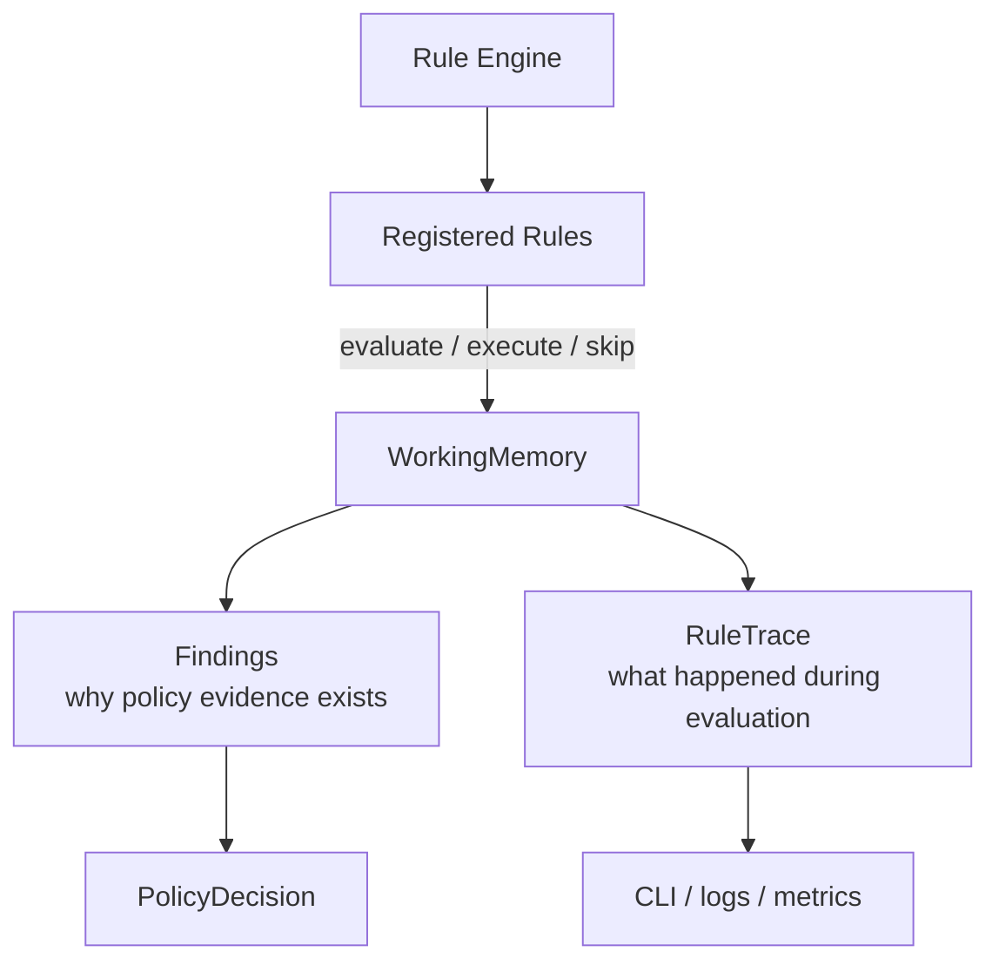

# Lesson 009: Rule Execution Trace

## Objective

Make the inference process observable by recording what happened to every registered Rule during an Engine cycle.

## Theory

Findings explain why a policy decision was produced, but they do not explain the complete evaluation path. An operator may also need to know:

- which Rule was evaluated
- whether its condition matched
- whether it executed an action
- whether it was disabled by configuration
- whether it was skipped because another Rule resolved its conflict group

`RuleTrace` provides that diagnostic record in Working Memory. It is not business state and does not change the decision; it is execution evidence for logs, CLI output, tests, and future metrics.

This distinction matters in a Rule Engine because a missing Finding can mean several different things: the condition was false, the Rule was disabled, or a higher-priority conflict winner already resolved the relevant group.

## Why This Matters Here

The current rule set contains all three useful cases:

- `DiscountRejectionRule` is evaluated but does not match a `20%` discount
- `DiscountApprovalRule`, `CustomBuildApprovalRule`, and `HighValuePaymentReviewRule` execute
- with `--disable-custom-build`, the CustomBuild Rule is registered but disabled before evaluation

The trace makes those differences visible without adding logging calls to every Rule implementation.

## Diagram



Findings and traces answer different questions: the first describes business evidence, while the second describes Engine behavior.

## Implementation Focus

Implement:

- `RuleTrace` data in Working Memory
- trace records for matched, non-matched, disabled, and conflict-skipped Rules
- CLI output for the trace
- a test that verifies the Engine records the evaluation path

Deliberately leave these for later lessons:

- exporting traces to structured logs or telemetry
- trace retention and correlation IDs
- metrics dashboards
- distributed rule execution

## What To Verify

From the `rules-engine-architecture` folder, run:

```text
go test ./...
go vet ./...
go run ./cmd/quote-demo
go run ./cmd/quote-demo --disable-custom-build
```

The default trace should show the rejection Rule as non-matching and the other active Rules as executed. The flagged run should show the CustomBuild Rule as disabled rather than evaluated.
