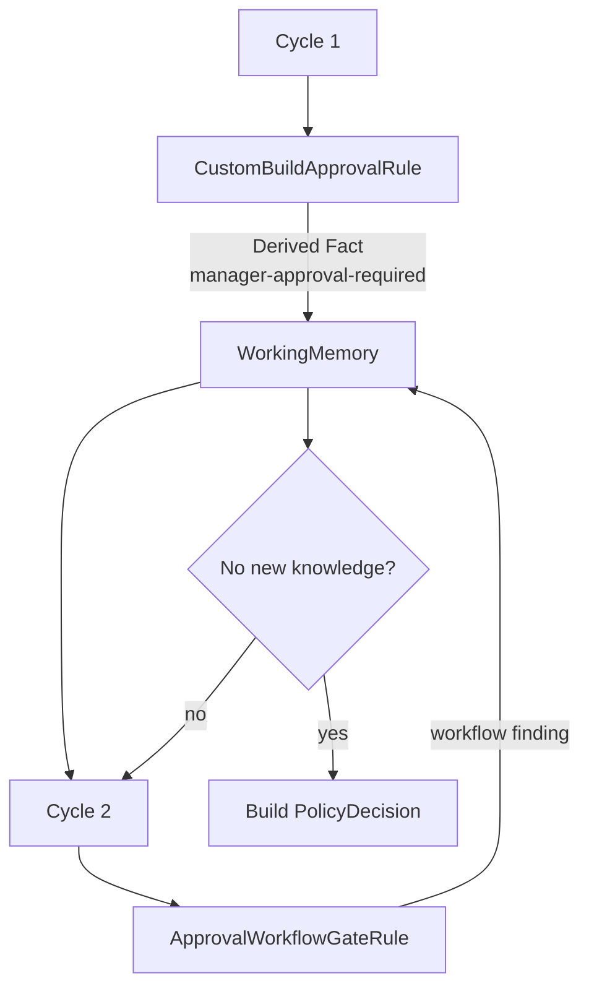

# Lesson 010: Forward Chaining And Inference Cycles

## Objective

Allow Rules to publish Derived Facts that can activate other Rules in a later inference cycle.

## Theory

The previous Engine evaluated the registered Rule set once. That is enough when every Rule reads only the original Facts, but a Knowledge-Based Architecture can also work incrementally:

1. a Rule observes the current Working Memory
2. it adds a Derived Fact
3. another Rule becomes applicable because of that Fact
4. the Engine evaluates another cycle
5. evaluation stops when no new Findings or Derived Facts appear

This is forward chaining. The Engine does not need a hardcoded call from the first Rule to the second one. The shared Working Memory is the coordination mechanism.

Because cycles can fail to converge, `ExecuteUntilStable` accepts a maximum cycle count and returns an error if the limit is reached.

## Why This Matters Here

The `CustomBuildApprovalRule` recognizes that manager approval is required, but it does not add a decision finding itself. It publishes only a `manager-approval-required` Derived Fact. A separate `ApprovalWorkflowGateRule` consumes that Fact and adds the workflow-facing finding “quote conversion is blocked until approval”.

This separation matters: the Derived Fact is the internal signal that enables forward chaining, while the workflow finding is the external explanation used to build the final `PolicyDecision`. The same approval requirement is therefore not recorded twice.

The two Rules remain decoupled:

- the producer does not call the consumer
- the consumer does not know why the Fact was produced
- the Engine simply observes whether another cycle has new knowledge

This is a stronger demonstration of Knowledge-Based Architecture than a static list of independent predicates.

## Diagram



The Engine controls the cycle and convergence policy. The Rules only inspect and enrich Working Memory.

## Implementation Focus

Implement:

- Derived Facts in Working Memory
- deduplicated Findings and Derived Facts for repeated cycles
- `Engine.ExecuteUntilStable`
- `CustomBuildApprovalRule` publishing only a Derived Fact
- `ApprovalWorkflowGateRule` consuming that Derived Fact and adding the workflow finding
- cycle-aware trace records and convergence tests
- CLI output showing the inferred workflow finding

Deliberately leave these for later lessons:

- agenda optimization
- salience/priority beyond the current deterministic sort
- rule retraction and truth maintenance
- distributed or asynchronous inference

## What To Verify

From the `rules-engine-architecture` folder, run:

```text
go test ./...
go vet ./...
go run ./cmd/quote-demo
```

The demo should require two productive inference cycles plus a final stable confirmation cycle: the CustomBuild Rule publishes the approval Fact first, and the workflow gate consumes it next. The Engine should then report convergence instead of looping indefinitely.
