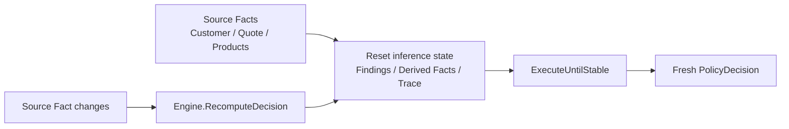

# Lesson 011: Recomputation After Fact Changes

## Objective

Make the lifetime of derived knowledge explicit when the original Facts change.

## Theory

`ExecuteUntilStable` is a monotonic inference session: Rules add Findings and Derived Facts, and the Engine stops when another cycle adds nothing new. It does not consume or retract those values during that session.

That is safe while the source Facts remain unchanged. If the caller changes a quote and evaluates the same `WorkingMemory` again, the old conclusions would otherwise remain visible. A full Rule Engine can solve this with provenance and truth-maintenance graphs. Our small engine uses a simpler, explicit policy: recomputation clears the previous inference results and evaluates the current source Facts from scratch.

The reset keeps the source Facts (`Customer`, `Quote`, and `Products`) and clears only inference-owned state:

- Findings
- Derived Facts
- execution Trace

This makes the tradeoff visible: explicit recomputation is easy to understand and deterministic, but it does not provide automatic per-fact retraction.

## Why This Matters Here

Consider a quote that initially contains a `CustomBuild` product. The Rules infer manager approval and block conversion. If the quote is edited to contain only a standard product, those conclusions must disappear from the next decision.

The caller should express that lifecycle explicitly through the Engine's recomputation operation instead of manually clearing individual collections.

## Diagram



The Engine owns the inference-session boundary. Source Facts are preserved; conclusions from the previous session are not.

## Implementation Focus

Implement:

- `WorkingMemory.ResetInferences`
- `Engine.RecomputeUntilStable`
- `Engine.RecomputeDecision`
- a test that changes a quote from `CustomBuild` to `Standard` and verifies that the approval Fact and workflow finding disappear

Deliberately leave these for later lessons:

- provenance-aware retraction of only the conclusions affected by one Fact
- truth-maintenance dependency graphs
- incremental agenda updates after individual Fact mutations

## What To Verify

From the `rules-engine-architecture` folder, run:

```text
go test ./...
go vet ./...
go run ./cmd/quote-demo
go run ./cmd/quote-demo --simulate-quote-edit
```

The normal demo remains a single inference session. With `--simulate-quote-edit`, it should first observe the manager-approval Fact and conversion-blocked finding, then replace the CustomBuild line with a Standard line, remove the discount, and produce an `allowed` decision with zero Findings. Later Rules may regenerate independent facts, such as Preferred discount eligibility; the important result is that the stale manager-approval fact is gone.
