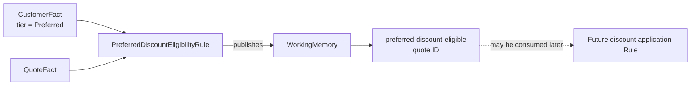

# Lesson 012: Preferred Discount Eligibility

## Objective

Represent tier-based discount eligibility as a Derived Fact without coupling the Rule Engine to a particular discount amount.

## Theory

The PRD says that customers with the `Preferred` tier receive automatic discount eligibility. Eligibility is not the same as applying a discount:

- eligibility answers whether a policy may be used
- a later policy can decide which discount, if any, to apply

The `PreferredDiscountEligibilityRule` publishes a `preferred-discount-eligible` Derived Fact when the customer tier matches. It does not mutate the quote's discount percentage and it does not add an approval finding.

This keeps the Rule independent from pricing details while giving other Rules a stable fact to consume. The Engine does not need to know which Rule produced the fact.

## Why This Matters Here

`CustomerFact` is passive data. The business meaning of the `Preferred` tier belongs in a Rule, where it can evolve independently from the Engine and from the customer model.

The result is also intentionally non-blocking. A quote can be eligible for a discount and still require approval for another reason, such as a manually requested discount above `15%`.

## Diagram



The eligibility fact is the extension point between policy detection and a future discount application policy.

## Implementation Focus

Implement:

- `PreferredDiscountEligibleFact`
- `PreferredDiscountEligibilityRule`
- tests for Preferred and non-Preferred customers
- registration of the Rule in the CLI demonstration

Deliberately leave these for later lessons:

- choosing a concrete automatic discount percentage
- combining multiple discount eligibility sources
- applying or persisting a discount during quote calculation

## What To Verify

From the `rules-engine-architecture` folder, run:

```text
go test ./...
go vet ./...
go run ./cmd/quote-demo
```

The default Preferred customer should produce a `preferred-discount-eligible` Derived Fact. The policy decision should still be driven by the existing approval and payment findings; eligibility alone is non-blocking. With `--simulate-quote-edit`, the fresh eligibility fact may remain after recomputation because the customer is still Preferred; it is not stale approval knowledge.
