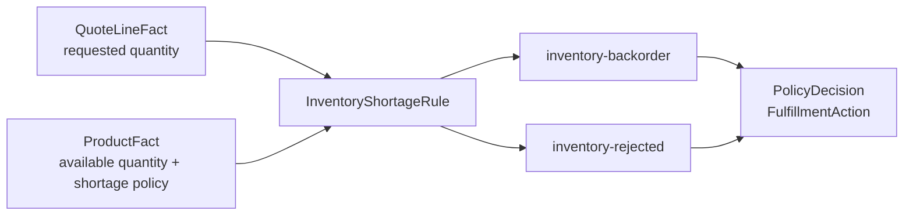

# Lesson 013: Inventory Shortage Policies

## Objective

Represent stock shortages as policy-driven outcomes: backorder or reject.

## Theory

Inventory shortage evaluation needs two kinds of Facts:

- the requested quantity from the `QuoteLineFact`
- the available quantity and shortage policy from the `ProductFact`

The `InventoryShortageRule` compares those Facts. When stock is insufficient, it produces a policy-specific result:

- `inventory-backorder` means the quote remains valid but fulfillment must wait
- `inventory-rejected` means the quote cannot proceed with the current policy

These are different from manager approval. The application-facing `PolicyDecision` therefore exposes a separate fulfillment action instead of hiding the result inside a generic approval outcome.

## Why This Matters Here

The PRD requires the same shortage condition to support different business policies. A product may be backordered while another product with the same shortage is rejected.

The Engine does not contain an `if policy == ...` branch. The policy is data in the Fact, and the Rule translates it into a deterministic outcome. Stock reservation and quantity mutation remain outside this lesson.

## Diagram



The same Rule detects the condition, while the Product Fact selects the business outcome.

## Implementation Focus

Implement:

- typed stock-shortage policies in the passive Product Fact
- `InventoryShortageRule`
- `PolicyDecision.FulfillmentAction`
- tests for backorder, rejection, and sufficient stock
- an optional CLI flag that simulates a shortage

Deliberately leave these for later lessons:

- reserving or releasing inventory
- updating available and reserved quantities
- partial shipment allocation
- persistence of stock changes

## What To Verify

From the `rules-engine-architecture` folder, run:

```text
go test ./...
go vet ./...
go run ./cmd/quote-demo
go run ./cmd/quote-demo --simulate-stock-shortage
```

The default scenario should have no shortage finding. The simulated shortage should produce an `inventory-backorder` finding and expose `backorder` as the fulfillment action, while a Rule test should prove that the same condition can produce rejection under a different Product policy.
