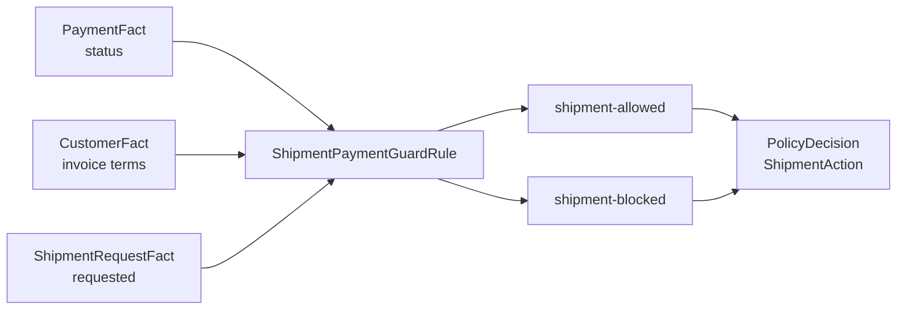

# Lesson 014: Payment And Shipment Guards

## Objective

Use lifecycle Facts to decide whether a shipment request is allowed by payment state and customer invoice terms.

## Theory

Shipment is not the same decision as quote approval or inventory fulfillment. A quote may be approved and in stock while shipment is still blocked because payment has not been accepted.

This lesson adds three passive pieces of context:

- `PaymentFact.Status`
- `ShipmentRequestFact.Requested`
- `CustomerFact.InvoiceTerms`

`ShipmentPaymentGuardRule` evaluates the request and publishes either an allowed or blocked shipment result. Invoice terms are an explicit exception: those customers may ship without an accepted payment.

The result is exposed as `PolicyDecision.ShipmentAction`, separate from `Outcome` and `FulfillmentAction`. Keeping these axes separate avoids making one generic status carry unrelated business decisions.

## Why This Matters Here

The PRD requires shipment to wait for accepted payment unless the customer is allowed to buy on invoice terms. This is a state guard, not a calculation and not a database operation.

The Rule reads a snapshot of payment and customer Facts. A later application layer can persist payment or shipment state after the decision; the Rule itself remains side-effect-free.

## Diagram



The guard contributes a shipment decision without overwriting approval or fulfillment decisions.

## Implementation Focus

Implement:

- payment status and shipment request Facts
- `ShipmentPaymentGuardRule`
- `PolicyDecision.ShipmentAction`
- accepted-payment, failed-payment, and invoice-terms tests
- CLI flags for simulated shipment and payment failure

Deliberately leave these for later lessons:

- payment provider integration or persistence
- payment capture side effects
- partial shipment allocation
- database transactions around shipment

## What To Verify

From the `rules-engine-architecture` folder, run:

```text
go test ./...
go vet ./...
go run ./cmd/quote-demo --simulate-shipment
go run ./cmd/quote-demo --simulate-shipment --simulate-payment-failure
```

An accepted payment should produce `shipment-allowed`. A failed payment for the default non-invoice customer should produce `shipment-blocked`, while the Rule tests should prove that invoice terms allow shipment despite the failed payment.
