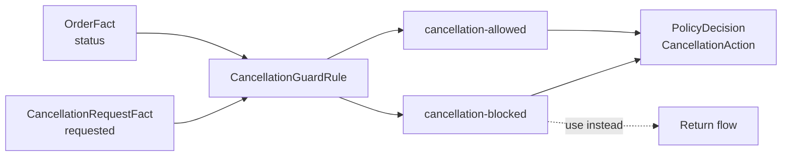

# Lesson 015: Cancellation State Rules

## Objective

Guard cancellation requests with the current order lifecycle state.

## Theory

Cancellation is a state-dependent policy:

- an order can be cancelled before any line has shipped
- after shipment, cancellation is blocked and the return flow must be used

The `CancellationGuardRule` reads two passive Facts: the cancellation request and the current `OrderFact.Status`. It publishes a separate cancellation action rather than changing the order status itself.

This keeps a Rule Engine decision free of persistence side effects. An application command can apply an allowed cancellation, release inventory, and save the new order status after the decision.

## Why This Matters Here

The PRD distinguishes cancellation from returns. A shipped order is not cancelled; it enters the return process instead.

The Rule therefore models a state transition guard, not an operation that mutates an aggregate or a database record. This makes the policy deterministic and independently testable.

## Diagram



The Rule decides whether the command is permitted; an outer application layer performs the state change.

## Implementation Focus

Implement:

- order status and cancellation request Facts
- `CancellationGuardRule`
- `PolicyDecision.CancellationAction`
- tests before and after shipment
- CLI flags for a cancellation request and shipped order

Deliberately leave these for later lessons:

- releasing reserved inventory
- persisting order status changes
- return eligibility and refund processing
- concurrent cancellation races

## What To Verify

From the `rules-engine-architecture` folder, run:

```text
go test ./...
go vet ./...
go run ./cmd/quote-demo --simulate-cancellation
go run ./cmd/quote-demo --simulate-cancellation --simulate-shipped-order
```

The first command should produce `cancellation-allowed`. The shipped-order variant should produce `cancellation-blocked` and direct the caller toward the future return flow.
