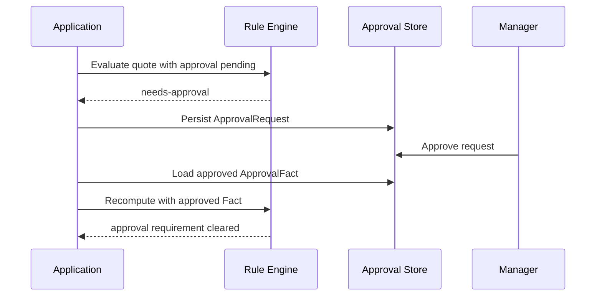

# Lesson 016: Human Approval Workflow

## Objective

Carry a manager approval from one inference run into the next as an external business Fact.

## Theory

The Rule Engine can discover that approval is required, but it cannot grant approval. The application must:

1. persist an approval request
2. let a manager approve or reject it outside the Engine
3. load the current approval status into the next Working Memory
4. evaluate the Rules again

`ApprovalFact` represents that external state. Approval-aware Rules only report an unresolved requirement while the status is not `approved`. Once approval is approved, the CustomBuild and discount approval Rules stop producing their pending-approval evidence.

This is a human-in-the-loop cycle, not a special callback inside the Rule Engine. The Engine remains deterministic for the Facts it receives.

## Why This Matters Here

The first evaluation can return `needs-approval`, but that is not the end of the order. Without an approval Fact, a second evaluation would rediscover the same requirement forever.

The approval status is therefore source state loaded from outside the Engine. `RecomputeDecision` clears the previous inference results, and the next run derives a fresh decision from the approved state.

## Diagram



The database and manager workflow are outside the Rules. They provide the Fact used by the next evaluation.

## Implementation Focus

Implement:

- approval status and `ApprovalFact`
- `WorkingMemory.ManagerApproval`
- approval-aware discount, CustomBuild, and workflow-gate Rules
- a CLI flag that simulates manager approval
- a test for pending approval followed by recomputation after approval

Deliberately leave these for later lessons:

- persistent ApprovalRequest storage
- manager authentication and authorization
- rejected or needs-more-information approval outcomes
- event-driven notification of approval changes

## What To Verify

From the `rules-engine-architecture` folder, run:

```text
go test ./...
go vet ./...
go run ./cmd/quote-demo
go run ./cmd/quote-demo --simulate-manager-approval
```

The default run should require manager approval. The simulated approval run should no longer produce the manager-approval or conversion-blocked findings. Independent findings, such as high-value payment review, may still remain.
