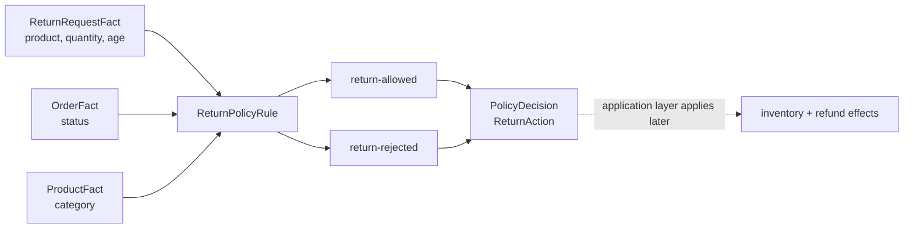

# Lesson 017: Return Eligibility Rules

## Objective

Evaluate a return request as an independent policy decision, separate from cancellation.

## Theory

Cancellation asks whether an order may stop before shipment. A return asks whether an item from a shipped order may come back afterward. They are different policies and should use different Facts and different outcomes.

`ReturnRequestFact` carries the request and the quantities already known by the application. `ReturnPolicyRule` combines it with the current `OrderFact` and the referenced `ProductFact`:

- the order must already be shipped
- clearance products are not returnable
- the request must be inside the return window
- the requested quantity must fit the remaining returnable quantity

The Rule publishes `return-allowed` or `return-rejected`. It does not add stock, create a refund, or mutate the order. Those are application-side effects after an allowed decision.

## Why This Matters Here

The PRD explicitly distinguishes cancellation from returns and requires both category and quantity policies. Keeping the return policy in its own Rule makes those constraints composable and independently testable.

The action-specific `ReturnAction` also prevents the general `PolicyDecision.Outcome` from pretending that every lifecycle operation is the same. A rejected return can coexist with other findings while clearly identifying the return operation that was blocked.

## Diagram



The Rule decides eligibility; it does not perform the accepted-return workflow.

## Implementation Focus

Implement:

- `ReturnRequestFact`
- `PolicyDecision.ReturnAction`
- `ReturnPolicyRule`
- tests for valid, unshipped, clearance, late, and excessive-quantity returns
- CLI flags that demonstrate a valid and rejected return

Deliberately leave these for later lessons:

- persisting a return request
- changing inventory after acceptance
- creating and tracking refunds
- partial-return records and idempotency
- configurable return windows per product category

## What To Verify

From the `rules-engine-architecture` folder, run:

```text
go test ./...
go vet ./...
go run ./cmd/quote-demo --simulate-return --simulate-shipped-order --simulate-manager-approval
go run ./cmd/quote-demo --simulate-return --simulate-shipped-order --simulate-clearance-return --simulate-manager-approval
```

The first run should produce `return-allowed`. The clearance variant should produce `return-rejected` and a rejected `ReturnAction`, without changing inventory or refund state.
