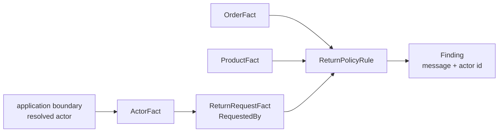

# Lesson 018: Return Actor Metadata

## Objective

Carry the identity of the actor who submitted a return request as a source Fact and include it in the policy explanation.

## Theory

Rules should not authenticate users or look up identities. They can, however, evaluate the business Facts supplied by the application.

`ActorFact` records the identity and role already resolved by the boundary that created the request. `ReturnRequestFact.RequestedBy` carries that Fact into the Rule Engine. The return Rule rejects a request without an actor and includes the actor id in an accepted-return explanation.

This keeps accountability visible without making the Rule Engine an identity provider.

## Why This Matters Here

A policy result is often audited later. Without the requester, an accepted or rejected return explains the product and quantity but not who initiated the action.

In a Rule Engine, provenance is another input Fact. The Rule remains deterministic and side-effect-free; authentication, authorization, and identity storage remain outside the engine.

## Diagram



The dashed boundary is conceptual: the Rule consumes identity, but it does not establish identity.

## Implementation Focus

Implement:

- `ActorFact`
- `ReturnRequestFact.RequestedBy`
- missing-actor validation in `ReturnPolicyRule`
- actor provenance in the return finding message
- tests and demo data for the requester

Deliberately leave these for later lessons:

- authentication and authorization
- reviewer and processor identities
- audit-log persistence
- actor-specific policy permissions

## What To Verify

From the `rules-engine-architecture` folder, run:

```text
go test ./...
go vet ./...
go run ./cmd/quote-demo --simulate-return --simulate-shipped-order --simulate-manager-approval
```

The valid return explanation should identify the requester. A return request without an actor should be rejected by the Rule.
