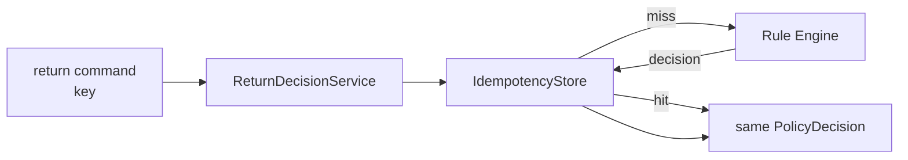

# Lesson 019: Return Command Idempotency

## Objective

Make a return-decision command safe to retry without executing the Rule Engine twice.

## Theory

Networks and callers retry commands. A repeated command must not create a second business result just because the first response was lost.

Idempotency is not a Rule condition. It is an application-boundary concern:

1. the caller supplies a command key
2. the boundary checks an idempotency store
3. the first request evaluates the Facts and stores the result
4. a retry returns the stored result without invoking the Engine

The Rule Engine remains responsible for deterministic policy evaluation. The application service is responsible for remembering that a command has already been processed.

## Why This Matters Here

Adding duplicate-detection to `ReturnPolicyRule` would mix transport history with return policy. A clearance rule should not know whether a message was delivered twice.

Keeping the store outside the Engine also makes the tradeoff visible: the demo uses memory, while production could use a database or a distributed store with the same application contract.

## Diagram



The store surrounds the Engine; it is not another Knowledge Source.

## Implementation Focus

Implement:

- an in-memory idempotency store
- an application service that evaluates once and replays a stored decision
- command-key validation
- a CLI retry demonstration
- tests proving the second call does not add a second execution trace

Deliberately leave these for later lessons:

- durable idempotency storage
- expiration and cleanup policies
- distributed locking
- HTTP transport concerns

## What To Verify

From the `rules-engine-architecture` folder, run:

```text
go test ./...
go vet ./...
go run ./cmd/quote-demo --simulate-return --simulate-shipped-order --simulate-manager-approval --return-command-key return-001 --simulate-return-retry
```

The retry should report a replayed decision and zero new inference cycles.
