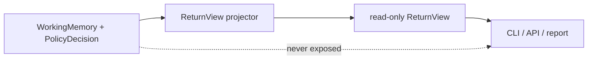

# Lesson 020: Return Query Surface

## Objective

Expose a read-only return view without making callers depend on the mutable Working Memory.

## Theory

The Rule Engine is optimized for evaluating Facts. A screen or API consumer usually needs a smaller, stable view:

- the order and product involved
- the requested quantity and remaining quantity
- the requester
- the current return action and explanation

`ReturnView` is a read model built after evaluation. It is not another Rule and it does not recalculate eligibility. The application can later build the same shape from a database projection instead of an in-memory Working Memory.

## Why This Matters Here

Returning `WorkingMemory` directly leaks internal inference state, derived Facts, and mutable slices to query callers. A projection keeps the Rule Engine boundary clear: Rules decide; read models present.

This also makes the architecture honest about CQRS-like separation without pretending that a full database or HTTP layer is required for the tutorial.

## Diagram



The projector reads the decision; it does not run Rules again.

## Implementation Focus

Implement:

- a `ReturnView` read model
- a projector that copies return data and the return explanation
- a CLI display of the projected view
- tests proving the view is independent from Working Memory mutations

Deliberately leave these for later lessons:

- database-backed query handlers
- pagination and filtering
- HTTP transport
- a shared read database for all order resources

## What To Verify

From the `rules-engine-architecture` folder, run:

```text
go test ./...
go vet ./...
go run ./cmd/quote-demo --simulate-return --simulate-shipped-order --simulate-manager-approval
```

The demo should print a return query view while the Rule trace remains an internal engine detail.
