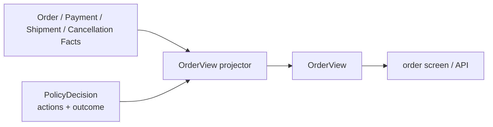

# Lesson 021: Order Query Surface

## Objective

Project the order lifecycle and action-specific policy results into a read-only order view.

## Theory

The Engine evaluates several independent concerns for one order:

- payment state
- shipment request and guard
- cancellation request and guard
- return eligibility
- the overall policy outcome

An order query should not force a caller to understand every Finding severity or inspect Working Memory. `OrderView` composes the relevant read fields while leaving the source Facts and decision immutable from the query's point of view.

## Why This Matters Here

Action-specific results are intentionally separate from `PolicyDecision.Outcome`. A consumer can see that an order is generally under payment review while cancellation is not requested and a return is allowed.

The projection makes that distinction visible without adding a coordinator Rule or hiding lifecycle state inside an entity.

## Diagram



The projector combines read data; it never changes the lifecycle or runs the Engine.

## Implementation Focus

Implement:

- an `OrderView` read model
- projection of lifecycle state and action-specific decisions
- CLI display of the order view
- tests for the composed fields

Deliberately leave these for later lessons:

- order persistence
- order command handling
- a dedicated order aggregate
- query pagination and authorization

## What To Verify

From the `rules-engine-architecture` folder, run:

```text
go test ./...
go vet ./...
go run ./cmd/quote-demo --simulate-shipment --simulate-payment-failure
```

The order view should expose shipment/payment actions separately from the overall decision outcome.
