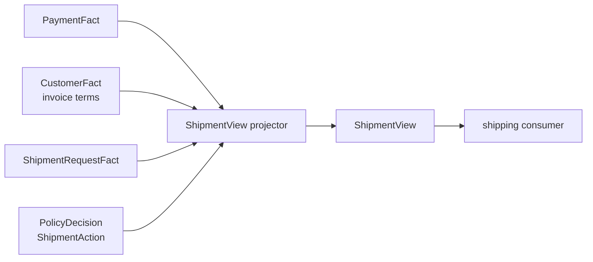

# Lesson 022: Shipment Query Surface

## Objective

Expose the shipment-specific decision through a focused read model.

## Theory

The shipment subsystem should not parse every policy finding. It needs a small view:

- which order requested shipment
- whether payment or invoice terms allow it
- whether shipment is allowed or blocked
- the explanation that led to that action

`ShipmentView` is a read projection over source Facts and the `ShipmentAction` in `PolicyDecision`. It is not a shipment command and it does not allocate inventory or create a shipment record.

## Why This Matters Here

The Engine can evaluate payment, approval, inventory, return, and cancellation policies in one pass. A shipment consumer should remain decoupled from those unrelated Rule details.

The focused view is also a natural contract for a future shipping adapter or queue publisher.

## Diagram



The consumer reads a projection; it does not become a second Rule Engine.

## Implementation Focus

Implement:

- a `ShipmentView` read model
- projection of payment, invoice terms, request, action, and reason
- CLI display for requested shipments
- focused projection tests

Deliberately leave these for later lessons:

- shipment creation commands
- carrier integration
- tracking events
- partial shipment quantities

## What To Verify

From the `rules-engine-architecture` folder, run:

```text
go test ./...
go vet ./...
go run ./cmd/quote-demo --simulate-shipment --simulate-payment-failure
```

The shipment view should show `blocked` and explain that payment is not accepted.
