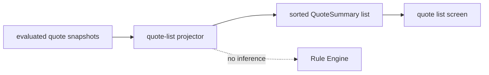

# Lesson 023: Quote List Query Surface

## Objective

Build a deterministic list view from evaluated quote snapshots without rerunning the Rule Engine.

## Theory

A list screen needs summaries, not complete Working Memories:

- quote identity and customer
- quote status and discount
- subtotal
- current outcome and required reviews

`EvaluatedQuote` pairs a source snapshot with the `PolicyDecision` already produced for it. `ProjectQuoteList` turns those pairs into small summaries and sorts them by quote id. It is a read operation; it never calls `Engine.Decide`.

## Why This Matters Here

Rule evaluation can be expensive or intentionally event-driven. Querying a list should not unexpectedly run inference again or create new findings.

The projection also keeps the list contract stable while the internal Working Memory continues to contain traces, derived Facts, and rule-specific details.

## Diagram



The dashed relationship means the projector deliberately does not call the Engine.

## Implementation Focus

Implement:

- `EvaluatedQuote` input snapshots
- `QuoteSummary` and quote-list projection
- deterministic sorting and subtotal calculation
- CLI display of the current quote list
- tests proving projection does not add Rule traces

Deliberately leave these for later lessons:

- database-backed quote storage
- pagination and search filters
- query authorization
- asynchronous projection updates

## What To Verify

From the `rules-engine-architecture` folder, run:

```text
go test ./...
go vet ./...
go run ./cmd/quote-demo
```

The demo should display a quote-list summary after the one normal evaluation, with no additional inference cycle.
