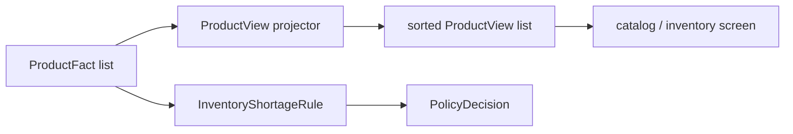

# Lesson 024: Product Query Surface

## Objective

Expose catalog and inventory facts through a stable product read model.

## Theory

Product queries need descriptive data and current stock information:

- product identity and category
- price
- available quantity
- shortage policy

`ProductView` copies those fields from `ProductFact`. It does not decide whether a quote should backorder or reject; that remains the responsibility of `InventoryShortageRule`.

## Why This Matters Here

The same Fact can feed both policy evaluation and a read surface. Keeping the projection separate prevents query formatting concerns from leaking into Rules and prevents callers from changing the Working Memory through a returned slice.

It also makes the distinction between a fact and a decision visible: product data describes the situation, while the Rule produces policy evidence.

## Diagram



The query and policy paths share input Facts but do not share responsibilities.

## Implementation Focus

Implement:

- `ProductView`
- deterministic product projection and sorting
- CLI display of product views
- tests for copying and sorting product data

Deliberately leave these for later lessons:

- product persistence
- stock reservation commands
- catalog search indexes
- inventory write operations

## What To Verify

From the `rules-engine-architecture` folder, run:

```text
go test ./...
go vet ./...
go run ./cmd/quote-demo --simulate-stock-shortage
```

The product view should show the changed stock while the policy decision continues to come from the inventory Rule.
