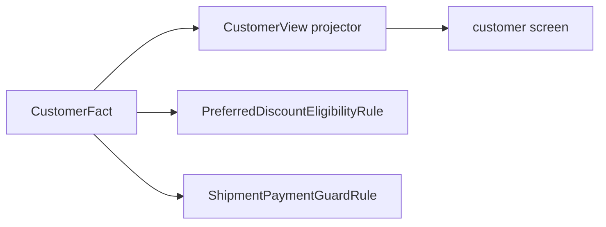

# Lesson 025: Customer Query Surface

## Objective

Expose customer facts through a read model without moving customer-related policy into the query layer.

## Theory

Customer queries need identity and commercial terms:

- customer id and name
- tier
- invoice-terms eligibility

`CustomerView` copies these descriptive Facts. `PreferredDiscountEligibilityRule` and `ShipmentPaymentGuardRule` continue to consume the original `CustomerFact` when making policy decisions.

## Why This Matters Here

The Rule Engine architecture separates data from behavior. A customer read model should not gain methods such as `Customer.ApproveDiscount()` just because a screen displays the tier.

The same customer Fact may be projected for a UI and independently consumed by several Rules. This is reuse of data, not coupling of behavior.

## Diagram



The read path and policy path share a passive Fact but remain separate consumers.

## Implementation Focus

Implement:

- `CustomerView`
- deterministic customer projection and sorting
- CLI display of the current customer view
- tests for copying customer data

Deliberately leave these for later lessons:

- customer persistence
- customer commands
- credit-limit policies
- identity and authorization management

## What To Verify

From the `rules-engine-architecture` folder, run:

```text
go test ./...
go vet ./...
go run ./cmd/quote-demo
```

The customer view should show the same tier and invoice terms that the policy Rules received as Facts.
