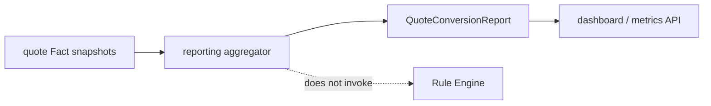

# Lesson 026: Quote Conversion Report

## Objective

Calculate a quote-to-order conversion report from source snapshots without turning reporting into another Rule.

## Theory

A report answers an aggregate question over many records:

- how many quotes exist
- how many reached `Converted`
- what percentage converted

`BuildQuoteConversionReport` consumes quote Facts that an application or read store already loaded. It does not call `Engine.Decide`, add Findings, or alter policy outcomes.

## Why This Matters Here

Rule Engines are good at evaluating one Working Memory against policies. They are not automatically reporting databases.

Keeping aggregation in a reporting package avoids a tempting but harmful design where a Rule mutates counters while evaluating individual quotes. The report can be rebuilt from source data and tested independently.

## Diagram



The report is a read-side aggregation, not an inference cycle.

## Implementation Focus

Implement:

- `QuoteConversionReport`
- conversion counting and percentage calculation
- CLI display for the current quote set
- tests for empty, partial, and fully converted sets

Deliberately leave these for later lessons:

- persistent analytics storage
- time-window filtering
- event streaming
- business Rules that decide whether conversion is allowed

## What To Verify

From the `rules-engine-architecture` folder, run:

```text
go test ./...
go vet ./...
go run ./cmd/quote-demo
```

The report should show the current quote as not converted while leaving the policy decision unchanged.
