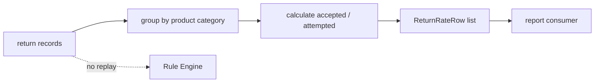

# Lesson 027: Return Rate By Category Report

## Objective

Aggregate return attempts and accepted returns by product category.

## Theory

The PRD asks for return rate by category. A report needs history, not only the current Working Memory. The small `ReturnRecord` input represents data already loaded from an event store or projection:

- category
- whether the attempt was accepted

`BuildReturnRateByCategory` groups records, calculates an acceptance/return rate, and returns deterministic category rows. It does not ask the Rule Engine to replay historical decisions.

## Why This Matters Here

Rules explain one decision from one Fact snapshot. Reports answer questions across many past decisions. Treating the report as a separate projection avoids polluting Rules with counters and time-series state.

The demo intentionally uses the current return evaluation as one record only to make the flow visible without adding persistence yet.

## Diagram



Historical aggregation and current policy evaluation are separate concerns.

## Implementation Focus

Implement:

- a small `ReturnRecord` reporting input
- return-rate rows grouped by category
- deterministic sorting and percentage calculation
- CLI display when a return is requested
- tests for multiple categories and empty history

Deliberately leave these for later lessons:

- event-store persistence
- time-window filtering
- denominator choices based on units sold
- scheduled report execution

## What To Verify

From the `rules-engine-architecture` folder, run:

```text
go test ./...
go vet ./...
go run ./cmd/quote-demo --simulate-return --simulate-shipped-order --simulate-manager-approval
```

The demo should print one category row without causing a second inference run.
