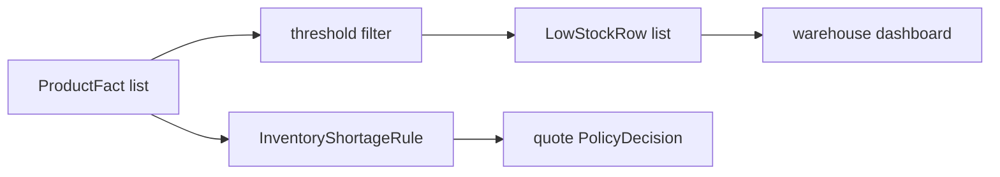

# Lesson 028: Low-Stock Report

## Objective

Project products below an operational stock threshold without confusing monitoring with shortage policy.

## Theory

The inventory Rule answers a quote-specific question: can this requested quantity be fulfilled, backordered, or rejected?

A low-stock report answers an operational question over the catalog: which products have available quantity below a threshold? `BuildLowStockReport` is a pure aggregation over `ProductFact`s and returns sorted rows.

## Why This Matters Here

Both concerns read the same stock Fact but produce different outputs. If low-stock monitoring were implemented as a Rule that added Findings to every quote, unrelated quotes would inherit warehouse alerts.

Keeping it in reporting preserves the scope of the policy Engine and makes the threshold explicit at the reporting boundary.

## Diagram



The monitoring and quote-policy paths are intentionally separate.

## Implementation Focus

Implement:

- `LowStockRow`
- configurable threshold filtering and sorting
- a CLI threshold flag and report display
- tests for boundary and empty cases

Deliberately leave these for later lessons:

- reservation writes
- replenishment commands
- warehouse notifications
- time-series stock history

## What To Verify

From the `rules-engine-architecture` folder, run:

```text
go test ./...
go vet ./...
go run ./cmd/quote-demo --low-stock-threshold 3
```

The default demo data should report `PRD-002` as low stock without adding a Rule finding.
