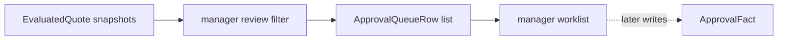

# Lesson 029: Orders Awaiting Approval Report

## Objective

Project evaluated quote decisions that require manager approval into an approval queue.

## Theory

The approval queue should consume the stable decision contract:

- quote and customer identity
- manager approval requirement
- explanations that help the manager decide

`BuildOrdersAwaitingApprovalReport` filters `EvaluatedQuote` snapshots by `ReviewManagerApproval`. It does not infer approval from a Rule trace and it does not approve anything.

## Why This Matters Here

The Engine is responsible for discovering policy requirements. A manager-facing queue is an application/reporting concern that turns those requirements into work items.

This separation keeps human workflow orchestration outside the inference cycle while preserving the explainability produced by Rules.

## Diagram



The manager's later action becomes a source Fact for a future evaluation; the report itself is read-only.

## Implementation Focus

Implement:

- approval queue rows
- filtering by `ReviewManagerApproval`
- deterministic sorting and copied reasons
- CLI display of pending approval work
- tests excluding payment-only and allowed decisions

Deliberately leave these for later lessons:

- manager commands
- approval persistence
- notifications and assignment
- escalation and due dates

## What To Verify

From the `rules-engine-architecture` folder, run:

```text
go test ./...
go vet ./...
go run ./cmd/quote-demo
```

The default demo should show the quote in the approval queue because it has a manager-approval requirement.
