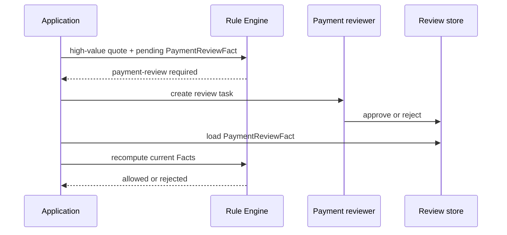

# Lesson 030: Payment Review Workflow

## Objective

Carry an external payment-review result into the next inference run without confusing review approval with payment acceptance.

## Theory

There are two different Facts:

- `PaymentFact` describes whether money has been accepted, failed, or is pending
- `PaymentReviewFact` describes whether a required high-value payment review is pending, approved, or rejected

`HighValuePaymentReviewRule` reports a review requirement while the review is pending. After an external reviewer approves it, the application loads an approved `PaymentReviewFact` and recomputes. If the reviewer rejects it, the Rule publishes a terminal rejection.

The Rule does not call a payment provider or a reviewer. It evaluates the current snapshot it receives.

## Why This Matters Here

An order can have an approved payment review while the actual payment is still pending or failed. Keeping the Facts separate avoids the dangerous shortcut “reviewed means paid”.

It also demonstrates that multiple human workflows can converge through the same Working Memory without adding callbacks to the Rules.

## Diagram



The review result changes policy evidence; it does not authorize payment capture by itself.

## Implementation Focus

Implement:

- `PaymentReviewStatus` and `PaymentReviewFact`
- approval-aware high-value payment Rule
- rejected-review decision mapping
- CLI flags for approved and rejected review
- recomputation tests for approval and rejection

Deliberately leave these for later lessons:

- payment provider calls
- review assignment and notifications
- payment capture commands
- durable review storage

## What To Verify

From the `rules-engine-architecture` folder, run:

```text
go test ./...
go vet ./...
go run ./cmd/quote-demo --simulate-manager-approval --simulate-payment-review-approved
go run ./cmd/quote-demo --simulate-payment-review-rejected
```

Approval should remove the payment-review requirement after recomputation. Rejection should produce a rejected policy outcome while leaving `PaymentFact` unchanged.
