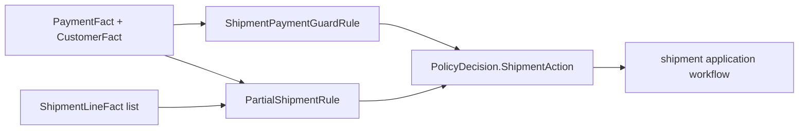

# Lesson 031: Partial Shipment Support

## Objective

Represent a partially shipped order as a shipment action without mutating inventory or shipment state.

## Theory

An order can contain lines where some quantity has already shipped and some remains. That is not the same as a blocked shipment and not necessarily the same as a full shipment.

`ShipmentLineFact` carries ordered and already-shipped quantities. A new `PartialShipmentRule` adds a `shipment-partial` finding only when the payment guard would allow shipment and at least one line is partially shipped.

The existing payment Rule remains independent. The final `ShipmentAction` is composed from both policies.

## Why This Matters Here

Partial fulfillment is a good example of composable Rules:

- payment policy says whether shipment may proceed at all
- shipment state policy says whether the permitted action is full or partial

Neither Rule creates a shipment record or decrements stock. An application/warehouse workflow can apply the action after evaluating the complete decision.

## Diagram



The two Rules contribute to one action without sharing mutable state.

## Implementation Focus

Implement:

- `ShipmentLineFact`
- `ShipmentPartiallyAllowed` action
- `PartialShipmentRule`
- partial-shipment CLI simulation and projection field
- tests for allowed, blocked, and full shipment cases

Deliberately leave these for later lessons:

- shipment allocation commands
- carrier and tracking integration
- reservation mutation
- split-shipment persistence

## What To Verify

From the `rules-engine-architecture` folder, run:

```text
go test ./...
go vet ./...
go run ./cmd/quote-demo --simulate-partial-shipment
go run ./cmd/quote-demo --simulate-partial-shipment --simulate-payment-failure
```

The first run should show `shipment=partial`; the payment-failure variant should remain `shipment=blocked`.
