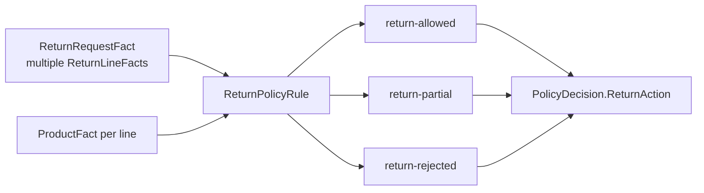

# Lesson 032: Partial Returns By Line

## Objective

Evaluate a return request containing multiple lines and distinguish a partially accepted return from a fully rejected request.

## Theory

The original return Fact represented one product and quantity. Real orders can request several lines at once, with different remaining returnable quantities.

`ReturnLineFact` keeps shipped and previously returned quantities per product. `ReturnPolicyRule` evaluates every line:

- all valid lines produce `return-allowed`
- a mix of valid and invalid lines produces `return-partial`
- no valid lines produce `return-rejected`

The Rule still only publishes a decision. Inventory restocking and refunds remain application-side effects after the caller chooses how to process accepted lines.

## Why This Matters Here

Per-line evaluation is a natural fit for a Knowledge-Based Architecture: each line contributes evidence, and the final action is composed from the set of line results.

It also prevents a single invalid line from hiding a valid line or, in the opposite direction, accidentally approving the entire request.

## Diagram



Each line is checked independently, but the Rule emits one request-level action.

## Implementation Focus

Implement:

- `ReturnLineFact`
- multi-line evaluation in `ReturnPolicyRule`
- `ReturnPartiallyAllowed` action
- line-aware return projection and CLI simulation
- tests for accepted, partial, and fully rejected line sets

Deliberately leave these for later lessons:

- persisting accepted/rejected line outcomes
- per-line restocking and refunds
- line-level idempotency keys
- return authorization workflows

## What To Verify

From the `rules-engine-architecture` folder, run:

```text
go test ./...
go vet ./...
go run ./cmd/quote-demo --simulate-partial-return --simulate-shipped-order --simulate-manager-approval
```

The demo should report `return action=partial` and explain the rejected line without changing inventory or refund state.
