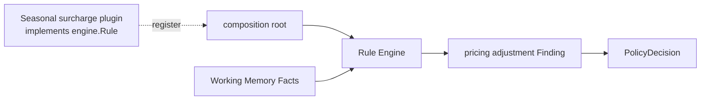

# Lesson 033: Plugin Rule Extension And Final Trade-offs

## Objective

Add a pricing Rule from a separate plugin package and make the final Rules Engine extension point visible.

## Theory

The `Rule` interface is the extension boundary. A plugin does not need to modify the Engine, the Working Memory algorithm, or existing policy Rules. It contributes a new Rule and the composition root registers it.

This lesson uses a seasonal surcharge plugin:

1. the plugin inspects the same passive Facts as any other Rule
2. it publishes a pricing adjustment Finding
3. `PolicyDecision` aggregates that adjustment
4. the application can use the decision when presenting or finalizing a quote

The demo uses a compiled-in plugin package. Dynamic loading, versioning, and plugin trust are deployment concerns that come later in a production system.

## Why This Matters Here

This is the Rules Engine's clearest contrast with a DDD-oriented design. A new policy is a new Rule that is registered at the boundary; the central inference algorithm remains unchanged.

The tradeoff is equally important:

| Strength | Cost |
| --- | --- |
| policies are isolated and easy to add | behavior is spread across Rules |
| conflict resolution is explicit | precedence and interactions need strong tests |
| Facts can be replayed deterministically | data quality and lifecycle ownership live outside the Engine |
| plugins extend the rule set | plugin compatibility and trust must be governed |

Use this architecture when policy volatility and rule composition justify that indirection. A small, stable domain may be clearer with a simpler service or rich domain model.

## Diagram



The dashed arrow represents the plugin implementation/registration relationship; runtime evaluation remains the same as for built-in Rules.

## Implementation Focus

Implement:

- pricing adjustment data on findings and decisions
- a separate `plugins` package with `SeasonalSurchargeRule`
- optional plugin registration in the CLI
- tests proving the plugin uses the existing Rule contract
- final comparison and trade-off summary

Deliberately leave these outside the tutorial:

- runtime binary/plugin loading
- plugin sandboxing and signing
- version negotiation
- a full pricing ledger or tax calculation engine

## What To Verify

From the `rules-engine-architecture` folder, run:

```text
go test ./...
go vet ./...
go run ./cmd/quote-demo --enable-seasonal-plugin --simulate-manager-approval --simulate-payment-review-approved
```

The plugin-enabled run should show a non-zero pricing adjustment while the existing Engine and built-in Rules remain unchanged.
