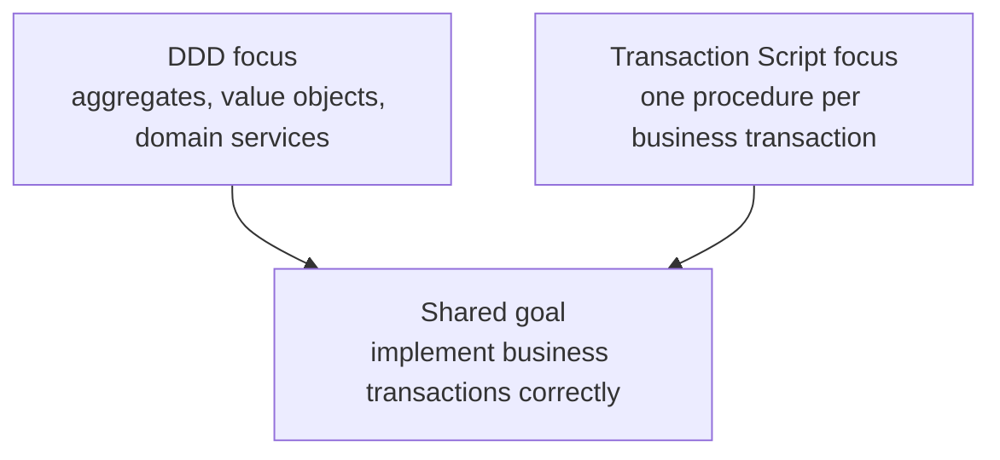

# Lesson 000: From Domain-Driven Design To Transaction Script

## Objective

Explain how Transaction Script differs from Domain-Driven Design, where the two overlap, and why it is worth studying a deliberately more procedural architecture after the DDD track.

## Short Answer

DDD and Transaction Script can implement the same business workflows, but they put the design effort in different places.

DDD asks:

- what language does the business use?
- which objects own the rules?
- where are the aggregate and consistency boundaries?
- which domain services express decisions that do not belong to one entity?

Transaction Script asks a more direct question:

- what steps must this business transaction perform from beginning to end?

Each use case becomes a procedure that reads data, checks rules, changes records, and saves the result. The data structures remain mostly passive.

So this track is not a claim that DDD was wrong or that procedural code is always better. It is a controlled comparison of a simpler center of gravity:

- DDD organizes around business meaning and domain behavior
- Transaction Script organizes around executable business transactions

## How They Are Related

Both architectures still need to represent the same business facts and outcomes.

Both can support:

- customers
- quotes
- approvals
- orders
- inventory
- payments
- shipments
- returns

Both can also validate inputs, enforce business rules, and persist state. The difference is where those responsibilities live.

In the DDD track, a quote changes through aggregate behavior and domain services. In the Transaction Script track, a procedure such as `CreateDraftQuote` coordinates the complete operation directly.

This means the application behavior can stay equivalent while the internal design becomes noticeably different.

## Diagram

## What Is Different

The main difference is the unit of organization.

DDD tends to organize around concepts and boundaries:

- `Quote` owns quote lifecycle rules
- value objects protect small invariants
- domain services express cross-object decisions
- application services coordinate workflows

Transaction Script tends to organize around actions:

- `CreateDraftQuote` creates a quote
- `AddQuoteLine` loads a quote and product, calculates the line, and saves the result
- `SubmitQuote` loads a quote, checks submission rules, changes its status, and saves it

The procedure is allowed to know the sequence of data access and business checks. That makes the path easy to follow, but it also means the procedure is more coupled to the records and storage shape.

## Is The Difference Mostly Semantic?

Partly, but not entirely.

Many systems described as Transaction Script still contain useful types, helper functions, and storage abstractions. Many DDD systems still have application procedures that coordinate a transaction.

The distinction becomes meaningful when deciding where a rule belongs.

In DDD, the question is often:

- which aggregate or domain service should own this rule?

In Transaction Script, the question is often:

- which transaction needs this rule, and what steps should that script perform?

Those choices affect coupling, duplication, test shape, and how the code evolves when the same rule is needed by several workflows.

## What Transaction Script Solves Better In This Comparison

Transaction Script is useful when the main pressure is:

"Make each business operation straightforward to read and inexpensive to implement."

### 1. The Use-Case Path Is Direct

A developer can open one procedure and see the transaction in execution order:

1. validate input
2. load the required records
3. check the business conditions
4. create or update a record
5. save the result

There is less indirection than in a design spread across aggregates, repositories, application services, and domain services.

### 2. Small Features Need Less Modeling Ceremony

For simple CRUD-like workflows, introducing a rich domain model may cost more than the rule complexity justifies. Transaction Script lets the implementation stay close to the feature request.

### 3. Data Shape And Workflow Coupling Become Visible

Because a script works directly with records, it is easy to see how a storage change can affect the business procedure. That is a useful tradeoff to study rather than an accidental detail to hide.

## What DDD Solves Better

DDD remains stronger when the main pressure is:

- protecting invariants across many workflows
- keeping business language explicit
- choosing aggregate boundaries
- preventing one procedure from owning too many unrelated rules

In the sample application, quote approval, inventory reservation, payment review, partial shipment, and returns can eventually share concepts and constraints. DDD gives those concepts explicit homes.

Transaction Script can still implement all of them, but the scripts may grow long or repeat logic. That is one of the pressures this track should make concrete.

## Questions A Student Might Naturally Ask

### "Is Transaction Script a step backward?"

No. It is a good fit when the workflow is simple, the rules are local, or the cost of a richer model is not justified. It becomes uncomfortable when rules need to be shared and protected across many transactions.

### "Does Transaction Script mean there can be no domain objects?"

No. It means the domain objects are not the primary owners of behavior. Passive records and focused helper types are still useful.

### "Why study it after DDD?"

Because DDD can make the cost of modeling visible, but it does not tell us whether that cost was necessary for every workflow. Transaction Script provides a practical lower-ceremony comparison using the same canonical requirements.

### "Will the business behavior change?"

It should not. The external behavior remains governed by the canonical product and use-case documents. What changes is how the implementation organizes the behavior internally.

## What Will Change In The Upcoming Lessons

Compared with the DDD track, expect the Transaction Script track to make these elements visible from the start:

- one procedure per business transaction
- passive records instead of behavior-rich aggregates
- direct coordination of reads, checks, writes, and persistence
- fewer interfaces and fewer layers in the first slice
- tests centered on the procedure's inputs, outputs, and stored records

The first runnable lesson will implement only draft quote creation. It will deliberately leave quote lines, approval, inventory, and other workflows for later lessons so the procedural growth pressure can be observed incrementally.

## Implementation Focus

This is a transition lesson only. It establishes the vocabulary and comparison point for the Transaction Script track; it deliberately adds no application code.

## What To Verify

- the difference between a business transaction procedure and a behavior-rich aggregate is clear
- Transaction Script is understood as a tradeoff, not a rejection of DDD
- the next lesson can begin with one `CreateDraftQuote` procedure and passive records
- the same canonical business behavior will be preserved while the internal organization changes

## Summary

Moving from DDD to Transaction Script changes the primary question from:

- where should business meaning and invariants live?

to:

- what steps must this transaction perform?

DDD gives the stronger model when shared business rules and domain boundaries dominate. Transaction Script gives the more direct implementation when local workflow clarity and low ceremony dominate.

That contrast is why this architecture is worth exploring next.
