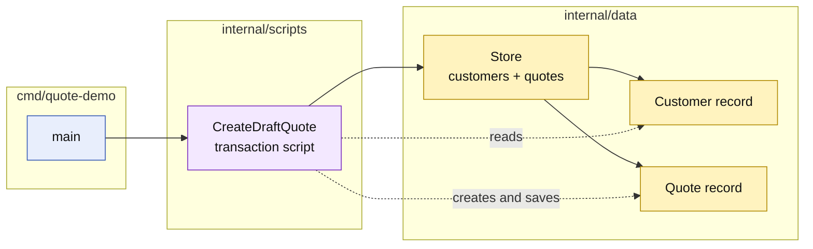

# Lesson 001: Transaction Script Skeleton

## Objective

Implement the first runnable Transaction Script slice: create a draft quote through one procedure that coordinates the complete business transaction.

## Theory

Transaction Script organizes business logic around the work a system must perform. Each transaction or use case has a procedure that handles its steps in order:

- validate the input
- read the records it needs
- apply the business checks
- create or update records
- persist the result

The records themselves are intentionally passive data. They hold fields such as `CustomerID` and `Status`, but they do not enforce their own lifecycle through methods or aggregates. The script is where the behavior lives.

This solves a useful problem for small applications: a developer can follow one use case from beginning to end without navigating a deep object model or a large set of abstractions. The tradeoff is direct coupling. As more scripts grow, they can repeat rules and depend more heavily on the shape of the storage model.

## Why This Matters Here

The previous DDD track made business behavior visible through aggregates, value objects, and domain services. This track deliberately changes the center of gravity.

For the first slice:

- `Customer` and `Quote` are data records
- `CreateDraftQuote` owns the active-customer rule and quote creation steps
- the script reads and writes the in-memory store directly
- there is no repository interface, application-service layer, or rich `Quote` behavior yet

That makes the architectural tradeoff visible rather than hiding it behind familiar abstractions.

## Diagram

Legend:

- blue: delivery edge
- purple: procedural business behavior
- yellow: passive data and storage
- solid arrows: runtime coordination
- dashed arrows: record access or mutation

## Implementation Focus

Implement only:

- a standalone Go module for the Transaction Script track
- passive `Customer` and `Quote` records
- a simple in-memory `Store` containing those records
- a `CreateDraftQuote` procedure that validates, checks the customer, creates a draft quote, and saves it
- tests for successful, inactive-customer, and unknown-customer cases
- a CLI composition root that seeds one customer and runs the script

Deliberately leave quote lines, approvals, repositories, domain methods, and additional transaction scripts for later lessons.

## What To Verify

- `go test ./...` passes from `transaction-script-architecture/`
- `go run ./cmd/quote-demo` creates a draft quote
- the created quote is present in the store
- inactive and unknown customers are rejected
- the business steps remain in `CreateDraftQuote` rather than in a rich domain object or repository abstraction
