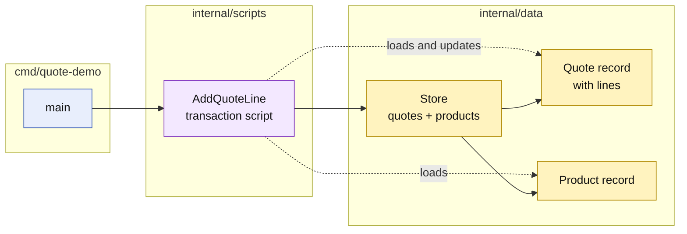

# Lesson 002: Add A Quote Line With A Transaction Script

## Objective

Add a second transaction script that loads a quote and product, validates the operation, appends a quote line, and saves the changed record.

## Theory

Transaction Script keeps the workflow for one business transaction in one procedure. This lesson adds `AddQuoteLine` beside `CreateDraftQuote` rather than adding methods to `Quote` or introducing a repository contract.

The script will perform these steps in order:

1. validate the quote ID, product SKU, and quantity;
2. load the quote record;
3. verify that the quote is still editable;
4. load the product record and check availability;
5. calculate the line total;
6. append the line and save the quote.

The `Quote`, `QuoteLine`, and `Product` types remain passive data. The workflow and its rules stay in the script.

## Why This Matters Here

The first lesson showed that one small transaction can be easy to follow when the procedure sees the data directly. This lesson tests whether that shape remains understandable when a transaction coordinates multiple records.

The implementation deliberately keeps these facts visible:

- `AddQuoteLine` knows the storage maps it reads and writes;
- the script owns the editable-quote and available-product checks;
- the quote record only contains fields and a slice of lines;
- no domain method or repository interface hides the workflow.

This is still a small and reasonable script. It also gives us the first concrete place to watch for future pressure: more scripts may need the same status checks, product rules, or price calculations.

## Diagram

Legend:

- blue: delivery edge
- purple: procedural business behavior
- yellow: passive data and storage
- solid arrows: runtime coordination
- dashed arrows: record access or mutation

## Implementation Focus

Implement only:

- `Product` and `QuoteLine` passive records;
- product storage in the in-memory `Store`;
- an `AddQuoteLine` transaction script;
- validation for missing quotes, inactive products, invalid quantities, and non-editable quotes;
- tests for the successful and rejected paths;
- a CLI demo that creates a quote and adds one product line.

Keep pricing plugins, approval policies, repositories, and rich quote methods for later lessons.

## What To Verify

- `go test ./...` passes from `transaction-script-architecture/`;
- the demo creates a draft quote and adds one line;
- the line uses a product snapshot and calculates its total;
- invalid quantities, unknown or inactive products, missing quotes, and non-draft quotes are rejected;
- `AddQuoteLine` contains the workflow while `Quote` remains a passive record.
