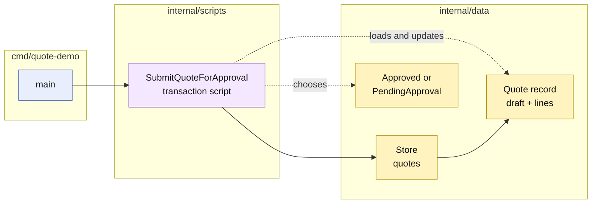

# Lesson 003: Submit A Quote For Approval With A Transaction Script

## Objective

Add a transaction script that moves a quote out of `Draft`, evaluates whether its lines require approval, and persists either `Approved` or `PendingApproval`.

## Theory

Submission is a workflow, not merely a field update. The script must coordinate several decisions in order:

1. load the quote;
2. confirm that it is still a draft;
3. require at least one line;
4. inspect the line data for an approval-triggering category;
5. choose the next status;
6. save the changed quote.

In a richer model, the quote or a domain policy might own these decisions. In this Transaction Script implementation, `SubmitQuoteForApproval` owns them directly. The quote remains a passive record and the category check remains a procedural condition.

## Why This Matters Here

The first two lessons showed scripts coordinating validation and data changes. This lesson adds a real lifecycle decision and exposes a characteristic Transaction Script tradeoff:

- the complete workflow is still easy to read in one place;
- the script now knows the quote lifecycle and the meaning of `CustomBuild`;
- another script that needs the same decision could repeat this rule;
- the storage record still has no behavior of its own.

The canonical behavior is preserved:

- a draft quote with no lines cannot be submitted;
- a standard quote becomes `Approved`;
- a quote containing a `CustomBuild` line becomes `PendingApproval`.

## Diagram

Legend:

- blue: delivery edge
- purple: procedural business behavior
- yellow: passive data and state
- solid arrows: runtime coordination
- dashed arrows: record access or decision assignment

## Implementation Focus

Implement only:

- `PendingApproval` and `Approved` quote statuses;
- product-category snapshots on quote lines;
- the `SubmitQuoteForApproval` transaction script;
- empty-quote, non-draft, standard-quote, and `CustomBuild` paths;
- tests for the resulting status transitions;
- a CLI demo that submits a quote after adding a line.

Leave explicit approval/rejection commands, approval-request records, order conversion, and extracted approval policies for later lessons.

## What To Verify

- `go test ./...` passes from `transaction-script-architecture/`;
- a standard quote becomes `Approved`;
- a `CustomBuild` quote becomes `PendingApproval`;
- an empty quote cannot be submitted;
- a non-draft quote cannot be submitted;
- the status decision remains in `SubmitQuoteForApproval` while `Quote` remains a passive record.
