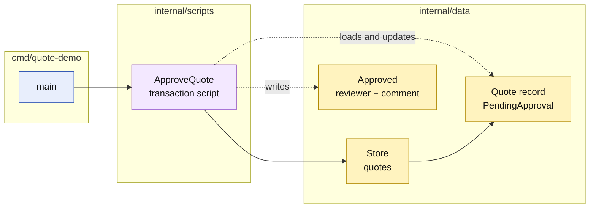

# Lesson 004: Approve A Pending Quote With A Transaction Script

## Objective

Add an explicit approval transaction that moves a `PendingApproval` quote to `Approved` and records who reviewed it.

## Theory

Submission and approval are different business transactions.

`SubmitQuoteForApproval` decides whether a quote needs review. `ApproveQuote` is a later action over a quote that is already waiting for review. The approval script will:

1. validate the quote ID and reviewer ID;
2. load the quote record;
3. require the `PendingApproval` status;
4. change the status to `Approved`;
5. record the reviewer and optional decision comment;
6. save the quote.

The data record remains passive. The script owns both the lifecycle check and the persistence sequence. Approval metadata is stored directly on the quote for now; a later lesson could introduce a separate approval record if that workflow becomes more complex.

## Why This Matters Here

The previous lesson introduced `PendingApproval`, but a state is not a complete workflow until it has a constrained next action.

This lesson makes the Transaction Script tradeoff clearer:

- the entire approval operation is easy to trace in one procedure;
- the script knows the allowed previous status;
- the script knows where review metadata is stored;
- another approval-related script could repeat these decisions or storage assumptions.

The canonical behavior remains explicit: only a pending quote can be approved, and approval requires a reviewer identity.

## Diagram

Legend:

- blue: delivery edge
- purple: procedural business behavior
- yellow: passive data and resulting state
- solid arrows: runtime coordination
- dashed arrows: record access or mutation

## Implementation Focus

Implement only:

- reviewer and decision-comment fields on the passive `Quote` record;
- an `ApproveQuote` transaction script;
- validation for missing reviewers, unknown quotes, and non-pending quotes;
- tests for valid approval and rejected transitions;
- a CLI branch that submits a custom-build quote and approves it.

Leave quote rejection, approval queues, separate approval records, and audit history for later lessons.

## What To Verify

- `go test ./...` passes from `transaction-script-architecture/`;
- a `PendingApproval` quote becomes `Approved`;
- the reviewer and decision comment are persisted;
- an already approved or draft quote cannot be approved;
- a missing reviewer is rejected;
- the lifecycle and persistence steps remain in `ApproveQuote` while `Quote` remains a passive record.
