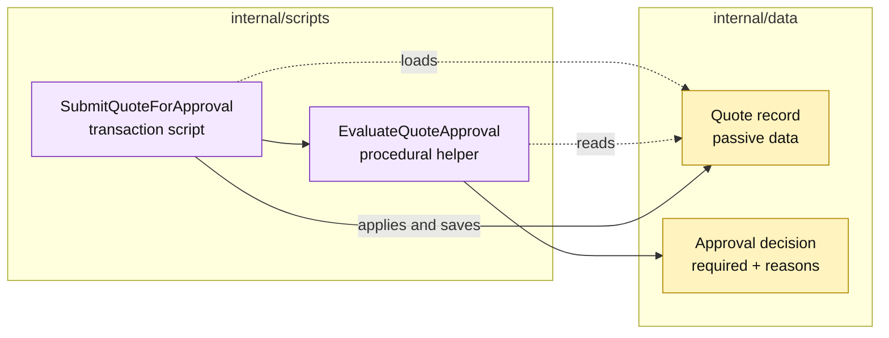

# Lesson 005: Extract The Approval Rule Into A Transaction-Script Helper

## Objective

Extract the approval decision from the submission procedure into a small reusable procedural helper without introducing a policy interface or a richer domain object.

## Theory

`SubmitQuoteForApproval` currently performs two jobs:

1. it coordinates the submission transaction;
2. it knows the rule that a `CustomBuild` line requires review.

That is still acceptable in a Transaction Script design, but the same decision will soon be useful to reports and other commands. A small `EvaluateQuoteApproval` helper gives the rule one named home while keeping the architecture procedural.

The helper returns a decision and reason codes. It does not mutate the quote, save data, or become an interface. The submission script remains responsible for loading the quote, applying the result, and persisting the state transition.

## Why This Matters Here

This is the first point where a Transaction Script implementation feels pressure to extract shared logic. The low-ceremony response is a plain function, not a gateway or a domain service hierarchy.

The tradeoff is deliberate:

- reuse improves and the submission workflow becomes easier to scan;
- the helper still depends on the shape and meaning of quote data;
- future rules can make the helper grow into a policy component if the application keeps expanding.

## Diagram

Legend:

- purple: procedural business behavior;
- yellow: passive data or a decision value;
- dashed arrows: data access;
- solid arrows: procedural calls or state mutation.

## Implementation Focus

Implement only:

- an approval decision value with deterministic reason codes;
- the `EvaluateQuoteApproval` helper;
- `SubmitQuoteForApproval` using the helper;
- tests proving the helper is non-mutating and the existing status transitions remain unchanged.

Do not add approval interfaces, approval records, or manager workflow changes yet.

## What To Verify

- `go test ./...` passes from `transaction-script-architecture/`;
- standard quotes return no approval reasons;
- a quote with a `CustomBuild` line requires approval;
- evaluating approval does not mutate the quote;
- submission still persists `Approved` or `PendingApproval` through one transaction script.
