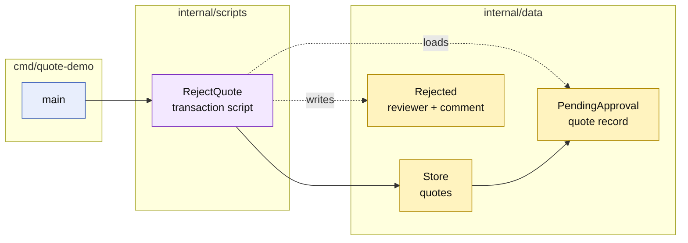

# Lesson 006: Reject A Pending Quote With A Transaction Script

## Objective

Add the rejection transaction that moves a `PendingApproval` quote to `Rejected` and records the manager's decision.

## Theory

Approval and rejection are sibling business transactions over the same review state. A pending quote must not be approved and rejected by changing a field from the outside; each action gets a procedure that validates the current state and persists the complete change.

`RejectQuote` will:

1. validate the quote and reviewer identifiers;
2. load the quote from the shared store;
3. require `PendingApproval`;
4. set `Rejected` and record the reviewer and explanation;
5. save the updated record.

The script owns the workflow. `Quote` remains a passive record, and no approval aggregate or repository abstraction is introduced.

## Why This Matters Here

The approval state is now a real branch rather than a one-way queue. This makes an important Transaction Script characteristic concrete: related commands can be easy to understand independently, but each procedure must know the lifecycle rules and storage fields it touches.

The direct approach is compact. Its cost is that approval, rejection, and future review commands can repeat the same status and metadata assumptions.

## Diagram

Legend:

- blue: delivery edge;
- purple: procedural business behavior;
- yellow: passive data and state;
- dashed arrows: record access or mutation.

## Implementation Focus

Implement only:

- the `Rejected` quote status;
- a `RejectQuote` transaction script;
- reviewer and comment persistence;
- valid and invalid rejection tests;
- a small CLI demonstration of the rejected branch.

Leave order conversion and inventory coordination for later lessons.

## What To Verify

- `go test ./...` passes from `transaction-script-architecture/`;
- only a pending quote can be rejected;
- reviewer identity is required;
- rejection metadata is saved with the quote;
- an approved or draft quote remains unchanged when rejection is refused.
